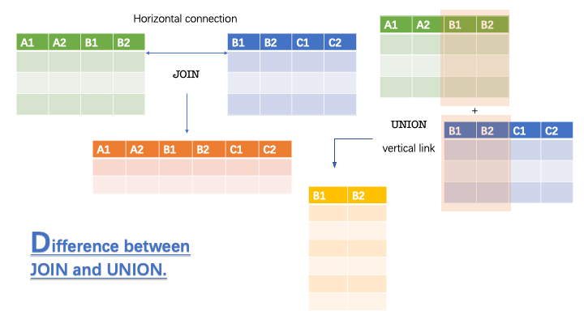

# SQL Data Query Language

## Syntax

Each table is identified by a **name** (e.g. "Customers" or "Orders"), and contain **records** (rows) with data.

!!! Note "NOTICE"
    + Note 01:SQL keywords are NOT case sensitive - ``select`` is the same as ``SELECT``
    + **Note 02:Require a semicolon(``;``) at the end of each SQL statement**

## Select

+ Select some columns of data from a database

```SQL
SELECT column1,column2,...
FROM table_name;
```

+ Select All columns of data

```SQL
SELECT * from table_name;
```

## SELECT DISTINCT

``SELECT DISTINCT`` can select and return only distinct value without repeated result!

```SQL
/*挑选列0中不同种类的值各一个，不重复*/
SELECT DISTINCT column0 FROM table1;
/*对照组，挑选出列0中所有元素*/
SELECT column0 FROM table1;
```

## WHERE

``WHERE`` in SQL is like ``if`` in C++,Python and so on.

```SQL
SELECT column01,colunm02,...
FROM table_name
WHERE condition;
```

It's important to know some operations which can be used in ``WHERE`` clause.

|Operator|Description|EXample|
|:---:|:---:|:----:|
|`=`,`>`,`<`,`>=`,`<=`|size relationship symbol||
|`<>`|Not Equal|``SELECT * FROM Products WHERE Price <> 18;``|
|`BETWEEN`|Between a certain range|``SELECT * FROM Products WHERE Price BETWEEN 50 AND 60;``|
|`LIKE`|Search for a **pattern**|``SELECT * FROM Customers WHERE City LIKE 's%';``|
|`IN`|To specify multiple possible values for a column|``SELECT * FROM Customers WHERE City IN ('Paris','London');``|

!!! Tip "More details about 'LIKE','BETWEEN','IN'"
    The `LIKE` operator can be combined with two wildcard characters to create flexible search patterns:
    1. Percent sign (`%`): Represents zero, one, or multiple characters.
    2. Underscore (`_`): Represents a single character.

    Now,I also introduce another two specific conditions:
    + To find all customers whose names start with 'a' and are at least three characters long
    ```SQL
    SELECT * FROM Customers
    WHERE CustomerName LIKE 'a__%';
    ```

    + To find all employees whose first names start with 'S' but do not start with 'Sh'
    ```SQL
    SELECT employee_id, first_name, last_name
    FROM employees
    WHERE first_name LIKE 'S%' AND first_name NOT LIKE 'Sh%'
    ORDER BY first_name;
    ```
    ---
    The `IN` operator allows you to specify multiple values in a WHERE clause.
    ```SQL
    SELECT column_name(s)
    FROM table_name
    WHERE column_name IN (value1, value2, ...);
    ```
    + `NOT IN` you must understand.
    + You can also use `IN`or `NOT IN` with a subquery in the WHERE clause.
    ```SQL
    SELECT * FROM Customers
    WHERE CustomerID IN (SELECT CustomerID FROM Orders);
    ```
    ---
    The `BETWEEN` operator selects values within a given range. The values can be **numbers, text, or dates**.
    + `NOT BETWEEN`
    + BETWEEN with IN
    ```SQL
    SELECT * FROM Products
    WHERE Price BETWEEN 10 AND 20
    AND CategoryID IN (1,2,3);
    ```
    + BETWEEN Dates
    ```SQL
    SELECT * FROM Orders
    WHERE OrderDate BETWEEN '07/01/1996' AND '07/31/1996';
    ```

## HAVING

The `HAVING` clause was added to SQL because **the `WHERE` keyword cannot be used with aggregate functions**.

```SQL
SELECT column_name(s)
FROM table_name
WHERE condition
GROUP BY column_name(s)
HAVING condition
ORDER BY column_name(s);
```

To better understand, you should master the code below and [test for yourself](https://www.w3schools.com/sql/trysql.asp?filename=trysql_select_having).Ask yourself like:

1. Can we give an alias to `COUNT(CustomerID)`?
2. What's purpose of the code?

```SQL
SELECT COUNT(CustomerID), Country
FROM Customers
GROUP BY Country
HAVING COUNT(CustomerID) > 5;
```

## JOIN

A `JOIN` clause is used to combine rows from two or more tables, based on a related column between them.

+ `INNER JOIN`


```SQL
SELECT column_name(s)
FROM table1
INNER JOIN table2
ON table1.column_name = table2.column_name;
```

We can also join more tables via `INNNER JOIN`:

```SQL
SELECT Orders.OrderID, Customers.CustomerName, Shippers.ShipperName
FROM (Orders
INNER JOIN Customers ON Orders.CustomerID = Customers.CustomerID)
INNER JOIN Shippers ON Orders.ShipperID = Shippers.ShipperID;
```

!!! Note "Dive into 'INNER JOIN'"
    You should be attention to 'JOIN',so you know that the result of `INNER JOIN` operation is a table contains all columns two tables have.
    You can test code above at the [W3 lab](https://www.w3schools.com/sql/trysql.asp?filename=trysql_select_join_inner2).

+ `LEFT JOIN`: The `LEFT JOIN` keyword returns all records from the left table (table1), and the matching records from the right table (table2)


```SQL
SELECT column_name(s)
FROM table1
LEFT JOIN table2
ON table1.column_name = table2.column_name;
```

!!! Note "Dive Into 'LEFT JOIN'"
    The essence of a `LEFT JOIN` s that **all rows in the left table (table1) appear in the result even if there are no matching rows in the right table (table2)**. If there are no matching rows in the right table, the columns in the right table **are populated with NULL values**.

+ `RIGHT JOIN`: The analogy is clear and will not be repeated.


+ `FULL OUTER JOIN`:  The FULL OUTER JOIN keyword returns all matching records from both tables whether the other table matches or not. So, if there are rows in "Customers" that do not have matches in "Orders", or if there are rows in "Orders" that do not have matches in "Customers", those rows will be listed as well.


!!! Tip "SELF JOIN"
    A self join is a regular join, but the table is joined with itself.
    ```SQL
    SELECT column_name(s)
    FROM table1 T1, table1 T2
    WHERE condition;
    ```
    And you will understand through the example below.The following SQL statement matches customers that are from the same city:
    ```SQL
    SELECT A.CustomerName AS CustomerName1, B.CustomerName AS CustomerName2, A.City
    FROM Customers A, Customers B
    WHERE A.CustomerID <> B.CustomerID
    AND A.City = B.City
    ORDER BY A.City;
    ```

At the end of the part, you should master an example concerning 'GROUP BY With JOIN Example':

```SQL
SELECT Shippers.ShipperName, COUNT(Orders.OrderID) AS NumberOfOrders FROM Orders
LEFT JOIN Shippers ON Orders.ShipperID = Shippers.ShipperID
GROUP BY ShipperName;
```

### Natural Join

The `NATURAL JOIN` keyword is used to join two tables based on common columns that have the same name.

```SQL
SELECT column_name(s)   
FROM table1
NATURAL JOIN table2;
```

!!! Tips "自然连接与内连接的区别"
    自然连接和内连接的主要区别在于它们返回的列数。自然连接会自动基于相同的属性名称和数据类型将两个表连接起来，结果表将包含两个表的所有属性，但只保留共同列的一个副本。而内连接则是基于ON子句中明确指定的列来连接两个表，结果表将包含两个表的所有属性，包括共同列。
    例如，如果有两个表 company 和 foods，它们都有一个 company_id 列，那么使用自然连接的查询可能如下所示：
    ```SQL
    SELECT *
    FROM company
    NATURAL JOIN foods;
    ```
    这将返回两个表的所有列，但只包含 company_id 列的一个副本。而使用内连接的查询可能如下所示：
    ```SQL
    SELECT *
    FROM company
    INNER JOIN foods
    ON company.company_id = foods.company_id;
    ```
    这将返回两个表的所有列，包括 company_id 列。结果表中 company_id 列将出现两次

🤔: Can I remove the `GROUP BY ShipperName`?

## UNION



The `UNION` operator is used to combine the result-set of two or more SELECT statements.

+ **Same number of columns**:Every SELECT statement within UNION must have the same number of columns
+ **Similar data types**:The columns must also have similar data types
+ **Same order**:The columns in every SELECT statement must also be in the same order

```SQL
SELECT colA,colB,... FROM table1
UNION
SELECT colA,colB,... FROM table2;
```

The `UNION` operator **selects only distinct values by default.** To allow duplicate values, use `UNION ALL`:

```SQL
SELECT City, Country FROM Customers
WHERE Country='Germany' #NOTICE this!
UNION ALL
SELECT City, Country FROM Suppliers
WHERE Country='Germany' #NOTICE this!
ORDER BY City;
```

## ORDER BY

The ``ORDER BY`` keyword is used to sort the result set in ascending or descending order.

```SQL
SELECT column1,column2
FROM table_name
ORDER BY column1,column2,... ASC|DESC;
```

For example, you can understand from the instance below:

```SQL
SELECT * FROM Products
ORDER BY Price DESC;
```

+ Order Alphabetially For String Type

+ Order By Several Columns

```SQL
SELECT * FROM Customers
ORDER BY Country, CustomerName;
/*ORDER BY Level1,Level2,....
if some rows have the same Country, it orders them by CustomerName*/
```

+ Using Both ASC and DESC

```SQL
SELECT * FROM Customers
ORDER BY Country ASC, CustomerName DESC;
```

## Logical Operator

In past some examples, we have introduced the `AND`,`OR`.They are mostly used in `WHERE` clause.

We bring our attention to `NOT`:

+ `NOT LIKE`
+ `NOT BETWEEN`
+ `NOT IN`
+ `WHERE NOT something > value`

## NULL VALUES

+ Is NULL？

```SQL
SELECT column_names
FROM table_name
WHERE column_name IS NULL;
```

+ Is NOT NULL？

```SQL
SELECT column_names
FROM table_name
WHERE column_name IS NOT NULL;
```

## SELECT TOP

The `SELECT TOP` statement is used to specify the number of records to return when it comes to **large tables with thousands of records**.

> Not all database systems support the ``SELECT TOP`` clause.

SQL server/MS Access Syntax:

```SQL
SELECT TOP numbers|percent column_name(s)
FROM  table_name
WHERE condition;
```

MySQL Syntax:

```SQL
SELECT column_name(s)
FROM table_name
WHERE condition
LIMIT number;
```

Let's show some examples to help you understand how to use them:

+ Add the ORDER BY keyword when you want to sort the result, and return the first 3 records of the sorted result.Suppose there are totaly 12 records in that table.

```SQL
/*SQL server version*/
SELECT TOP 3 * FROM table_name
ORDER BY Column_name DESC;

SELECT TOP 25 PERCENT table_name
ORDER BY Column_name DESC;
/*MySQL version*/
SELECT * FROM table_name
ORDER BY Column_name DESC
LIMIT 3;
```

## EXIST**

The `EXISTS` operator is used to test for the existence of any record in a subquery.
The `EXISTS` operator **returns TRUE if the subquery returns one or more records**.

```SQL
SELECT column_name(s)
FROM table_name
WHERE EXISTS
(SELECT column_name FROM table_name WHERE condition);
```

Let give you an more detailed example:

Example: `Beers(name*,manf)`

We will find beers that are the unique beer by their manufacture.

```SQL
SELECT name
FROM Beers b1
WHERE NOT EXIST
(SELECT * FROM Beers WHERE manf = b1.manf AND name <> b1.name);
```

## ANY

The `ANY` operator:(是任意一个，表示有任何一个满足就返回true)

+ returns a boolean value as a result
+ returns TRUE if ANY of the subquery values meet the condition

`ANY` means that the condition will be true if **the operation is true for any of the values in the range.**

```SQL
SELECT column_name(s)
FROM table_name
WHERE column_name operator ANY
  (SELECT column_name
  FROM table_name
  WHERE condition);
```

!!! Warning "About Operator"
    The operator must be a standard comparison operator (=, <>, !=, >, >=, <, or <=).

## ALL

The `ALL` operator:

+ returns a boolean value as a result
+ returns TRUE if ALL of the subquery values meet the condition
+ is used with `SELECT`, `WHERE` and `HAVING` statements

`ALL` means that the condition will be true only if the operation is true for all values in the range.

```SQL
SELECT column_name(s)
FROM table_name
WHERE column_name operator ALL
  (SELECT column_name
  FROM table_name
  WHERE condition);
```

## SQL Aggregate Functions

Aggregate functions are often used with `GROUP BY` clause of the `SELECT` statement.

<span style="font-family: 'Segoe UI', sans-serif; font-size: 1.05em; font-weight: 600; color: #2c3e50; background-color: #e8f4f8; padding: 6px 10px; border-radius: 4px; display: inline-block; border: 1px solid #b2d8e6;">The `GROUP BY` clause splits the result-set into groups of values and the aggregate function can be used to return a single value for each group.</span>

The most commonly used SQL aggregate functions are:

+ `MIN()` - returns the smallest value within the selected column
+ `MAX()` - returns the largest value within the selected column
+ `COUNT()` - returns the number of rows in a set
+ `SUM()` - returns the total sum of a numerical column
+ `AVG()` - returns the average value of a numerical column

Aggregate functions ignore null values (except for `COUNT()`).

### MIN & MAX

```SQL
SELECT MIN(column_name)|MAX(column_name)
FROM table_name
WHERE condition;
```

+ Set the returned Column's name

> When you use `MIN()` or `MAX()`, the returned column will not have a descriptive name. **To give the column a descriptive name**, use the `AS` keyword:

```SQL
SELECT MIN(Price) AS SmallestPrice
FROM table_name;
```

+ Use `MIN()` or `MAX()` with `GROUP BY`

```SQL
SELECT MIN(Price) AS SmallestPrice,CategoryID
FROM Products
GROUP BY CategoryID
```

!!! Note "Dive Into ‘AS’ keyword"
    + Using Aliases With a Space Character
    ```SQL
    /*就是别名有空格需要使用'[]'或者“”来包围你起的名字*/
    SELECT ProductName AS [My Great Products]
    FROM Products;
    ```
    + Concatenate Columns：The following SQL statement creates an alias named "Address" that combine four columns (Address, PostalCode, City and Country)
    ```SQL
    SELECT CustomerName, Address + ', ' + PostalCode + ' ' + City + ', ' + Country AS Address
    FROM Customers;
    /*MySQL version：*/
    SELECT CustomerName, CONCAT(Address,', ',PostalCode,', ',City,', ',Country) AS Address
    FROM Customers;
    ```
    + **Alias FOR Table**：when you are using more than one table in your queries, it can make the SQL statements shorter.
    ```SQL
    SELECT o.OrderID, o.OrderDate, c.CustomerName
    FROM Customers AS c, Orders AS o
    WHERE c.CustomerName='Around the Horn' AND c.CustomerID=o.CustomerID;
    ```

### COUNT

The `COUNT` function returns the number of rows that matches a specified criterion.

```SQL
SELECT COUNT(column_name)
FROM table_name
WHERE condition;
```

+ Find the total number of rows in a table:

```SQL
SELECT COUNT(*)
FROM table_name;
```

+ specify a column name instead of (*), **NULL values will not be counted**:

```SQL
SELECT COUNT(column_name)
FROM table_name;
```

+ To Ignore Duplicates of a column:

```SQL
SELECT COUNT(DISTINCT column_name)
FROM table_Name;
```

+ Give the counted column a name by using the `AS` keyword:

```SQL
SELECT COUNT(*) AS [Number of records]
FROM table_name;
```

### SUM

The `SUM` function returns the total sum of a numeric column.

+ Give the summarized column a name by using the `AS` keyword.

```SQL
SELECT SUM(column_name) as [name]
FROM table_name;
```

+ Use `Sum` with an Expression, The parameter inside the `SUM()` function can also **be an expression**.

```SQL
SELECT SUM(Quantity * 10)
FROM OrderDetails;
```

### AVG

The `AVG` function returns average value of a numeric column.

+ To list all records with **a higher price than average**, we can use the `AVG()` function **in a sub query**:

```SQL
SELECT * FROM Products
WHERE price > (SELECT AVG(price) FROM Products)
```
