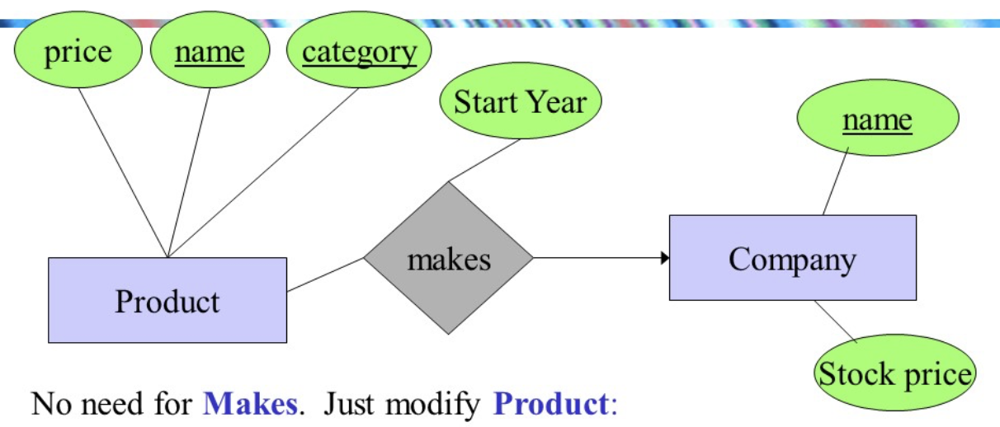
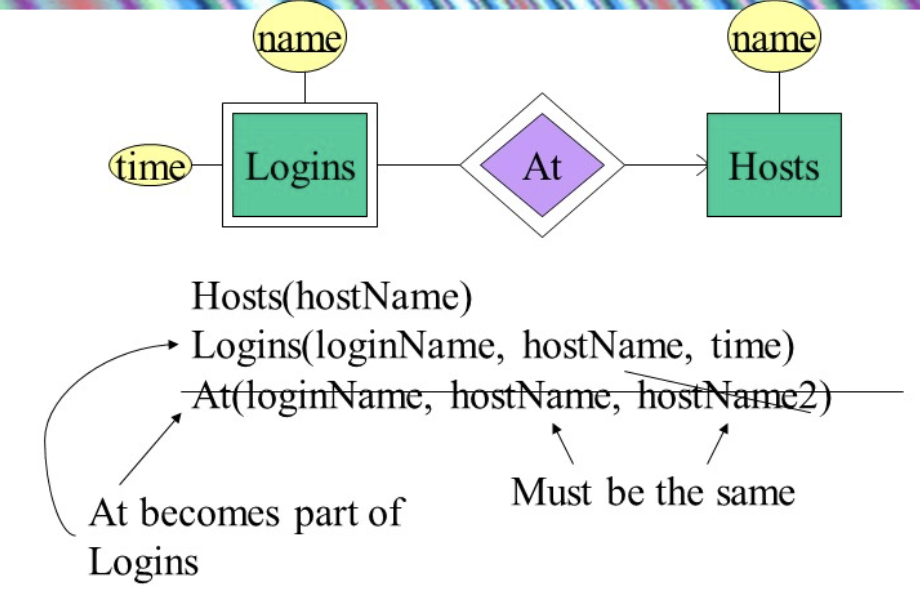
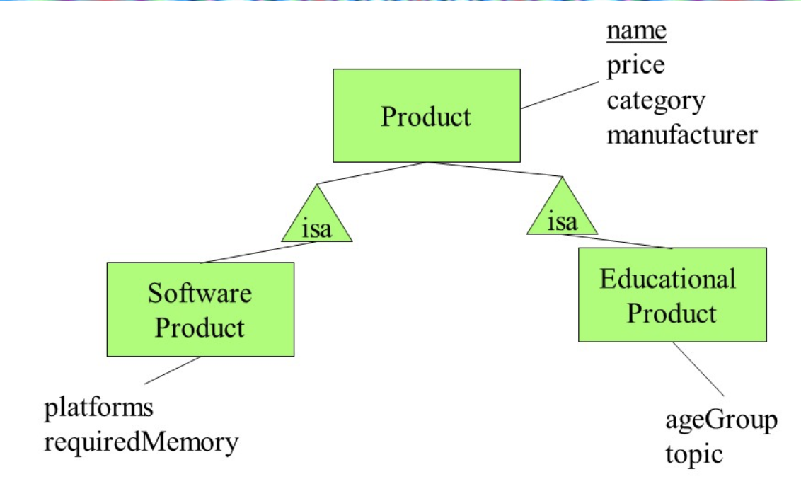
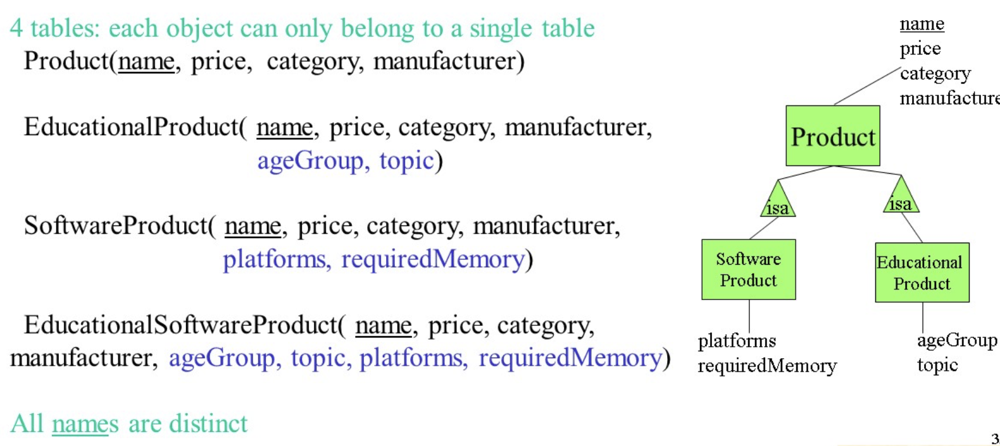
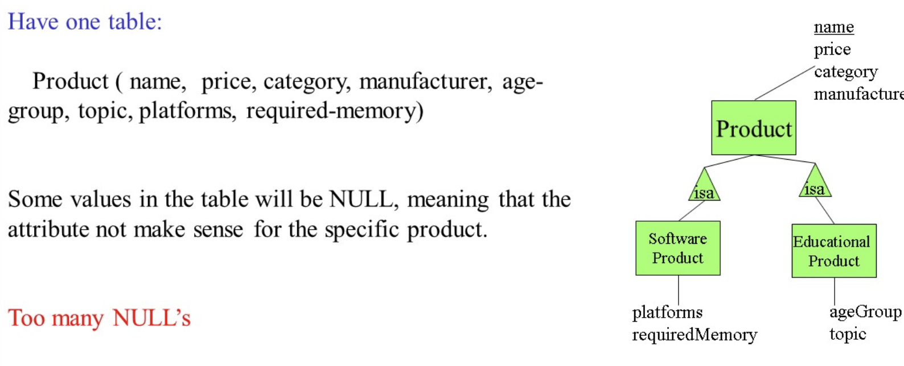

# Relation Data Model

> 前情提要：
>
> Basic Cases
>
> + 实体集合entity set $E$ 对应的是ER图中的矩形，可以转换为一个Table
> + 关系Relationship $R$ 对应的是ER图中的菱形，可以转换为一个Table
>
> Special Cases
>
> + combine two relations
> + translate weak entity sets
> + translate is-a relationships

我们转换ER图到关系`table`需要两步操作：

+ Entity set to Relation
+ Relationship to Relation

所以，上面的这个例子一共可以转化为**6张表格**（三个实体集合转换为3张表格，三个关系转换为3张表格）

## Special Cases01 - Combine Two Relations

如果两个关系之间**存在多对一的关系**，则可以将两个关系合并为一个关系。同理，**因为一对一的关系是特殊的多对一关系，所以也可以将两个一对一关系合并为一个关系**。但是，多对多的关系不能合并，会产生大量的数据冗余。

例如，在ER图中，存在两个关系$R_1$和$R_2$，它们之间存在多对一的关系，则可以将$R_1$和$R_2$合并为一个关系$R$。

## Special Cases02 - Translate Weak Entity Sets

如果实体集合$E$中存在**弱实体集**，则可以将弱实体集转换为一张表格

如上图意，我们的关系转换的那张表需要把两边实体集合的主键都放在关系的这张表中，会发现删除`hostName2`后（因为重复），`At`关系就是`Logins`的子集

## Special Cases03 - Translate Subclass Entities

一共有三种存储的方式：

+ 面向对象方式（OO approach）:each object only belong to a single table
  + **OO方法最省空间**，因为用更多的更精细的表减少重复，所以最省空间

+ ER方式（ER approach）：在父类存储所有信息，在子类存储独有信息

+ 全合并（Null Value Approach）: 合成一张表

## Integrity constraints

**实体完整性**：主属性（主键的属性）不能取空值并且唯一。
**参照完整性**：外键或者取参照关系中的某个主键值，或者取空值（表示还没有分配），就是外键需要符合的要求：

+ 或者值为空
+ 或者等于其所参照的关系中的某个元组的主键值

**用户定义的完整性**：针对某一具体关系数据库的约束条件。它反映某一具体应用所设计的数据必须满足的语义要求。比如说，某一个列中的数据不能超过100，某一列中的数据必须不能为空...这样的用户自定义的要求
