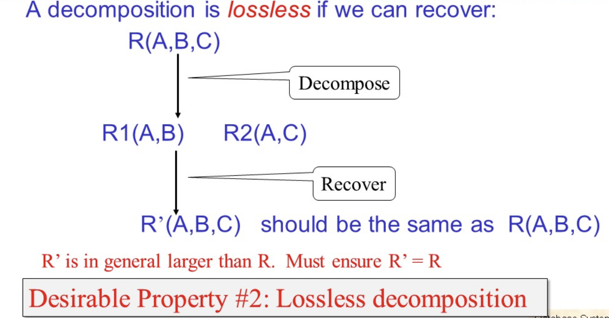
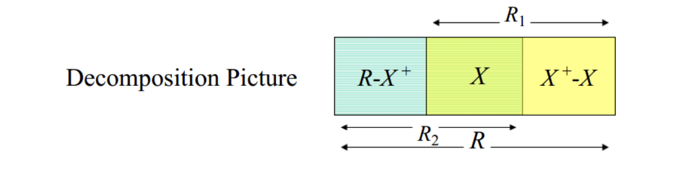
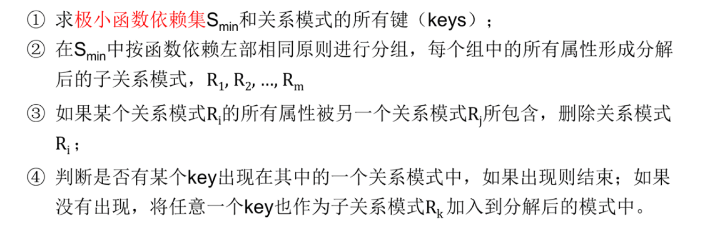
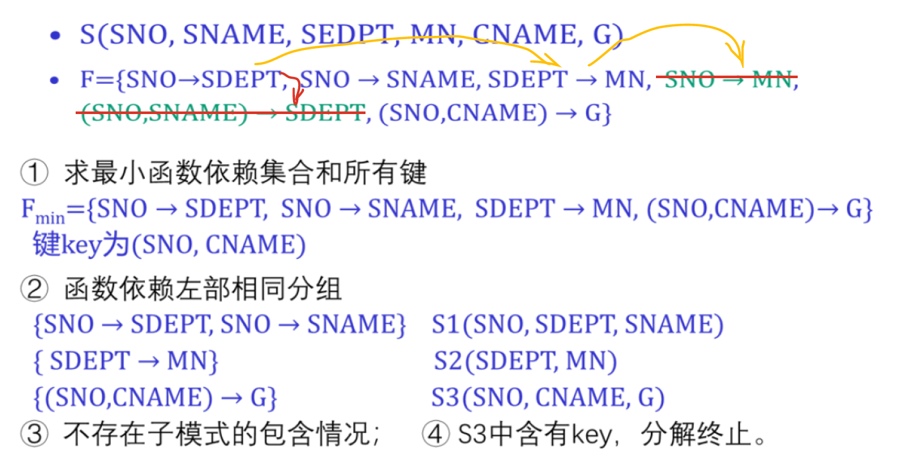
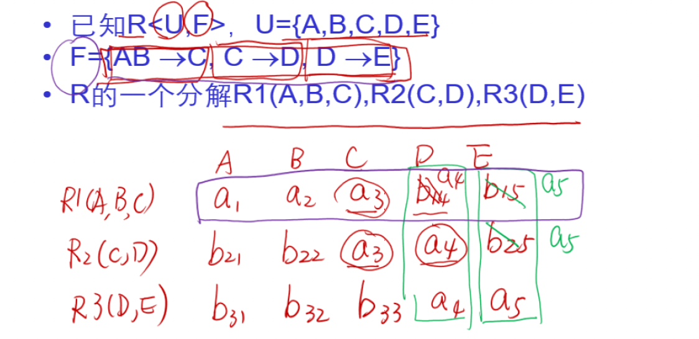
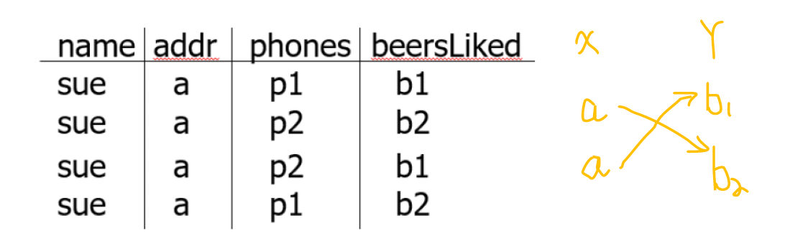
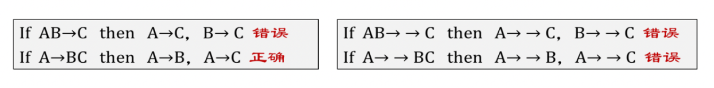

# Week 10: Schema Design II

> 主要内容：模式设计与细化4-5，BCNF

我们的四个设计原则：

+ 最小化冗余
+ 避免信息丢失，需要采用无损分解（拆分后的表再进行合并时候不能）
+ 保持原有的函数依赖
+ 确保是好的查询

## 无损分解

## BCNF范式

**所有**非平凡的函数依赖的左侧都是超键

+ **非平凡的函数依赖**：$A_1A_2,...,A_n \rightarrow B$，$B$不能是$A_1,A_2,...A_n$的子集。
+ **函数依赖左部分包含$key$**，也就是$A_1,A_2,...A_k$是一个超键

!!! Note "如何判断一个关系模式BCNF范式"
    首先，我们要求出该关系模式所有的key
    然后验证所有的函数依赖是否都是非平凡并且是超键

    **特别的**，
    + 只有两个属性的关系模式一定是BCNF范式
    + 没有函数依赖的关系模式一定是BCNF范式

如果一个关系模式不是BCNF范式，我们可以通过下面的方式对不满足该范式的关系进行拆分：

+ 首先确定违背BCNF的函数依赖$X \rightarrow Y$
+ 然后求$X$的闭包$X^+$，将$R$拆分成两个部分 $X^+$和 $R - X^+ + X$
+ 求出函数依赖的闭包，然后分配到两个集合中

总结来说，BCNF**消除了某些类型的冗余**，**避免了信息的丢失**，但是**不能很好的维持我们的函数依赖关系**，我们必须通过我们的三范式去达到我们的函数依赖的要求。

## 第一范式

第一范式是对关系模式的最低要求，如果一个关系模式不满足 1NF 则不能称为关系模式。

关系模式 R 的所有属性都是不可分（都是原子属性）的基本数据项

## 第三范式

动机：为了补上BC范式可能会丢掉函数依赖的问题，我们引入了第三范式。

对比BC范式，我们判定第三范式有所放松：

> 关于主属性，我们定义：
> **包含在任一候选码（key）中的属性**称主属性

我们假定一定满足**第一范式**

<code>X -> A</code> 违背三范式 如果 <code>X</code> 不是一个超键 并且 <code>A</code> 不是一个主属性

|属性|3NF范式|BCNF范式|
|:---:|:--:|:--:|
|能够满足保持无损分解|✅|✅|
|能够满足保持函数依赖|✅|❌|

### 保持函数依赖和无损连接的3NF模式分解算法

下面我们给出例子来感受下函数极小依赖集合是什么：

### 判断无损连接分解的算法

我们操作这个判断算法的流程：我们首先按照急诊的

---

+ 首先将所有的属性和关系模式列成表
+ 给每个关系模式标注覆盖的属性
+ 依次遍历函数依赖集合，左部相同的列右部也要相同，有`a`全用`a`，没有`a`用较小的`b`
+ 重复操作直到出现一行全是或者表不再变化，判断是否有一行全是`a`

## 多值依赖（Mutivalued Dependencies，MVD）

$$X \rightarrow \rightarrow Y$$

多值依赖的条件是：**如果一个关系的两个元组在的所有属性上一致，那么它们在属性集合中的组件可以交换，结果将是两个元组也在该关系中**。

!!! Note "所有的函数依赖都是多值依赖"
    记住，函数依赖是**多对一的**关系，所以一定是的。

多值依赖的一些规律：

+ 如果$X \rightarrow \rightarrow Y$，$Z$是一个其他的属性，那么我们可以得到：$X \rightarrow \rightarrow Z$

**多值依赖不可拆分！**

## 4范式

$4$ 范式主要用于消除$BCNF$范式消除不掉的多值依赖冗余

4NF 要求关系模式满足：

<strong>任何一个非平凡多值依赖</strong><code>X ->-> Y</code>都满足<code>X</code>是超键

非平凡是指：

+ $Y$不是$X$
+ $X$和$Y$并不是所有的属性

我们在计算$key$属性的时候，跟多值依赖没有关系，只跟我们的函数依赖有关

**如果一个范式是4NF，那么他一定是BCNF的。**
