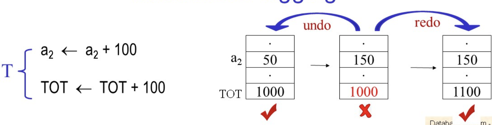
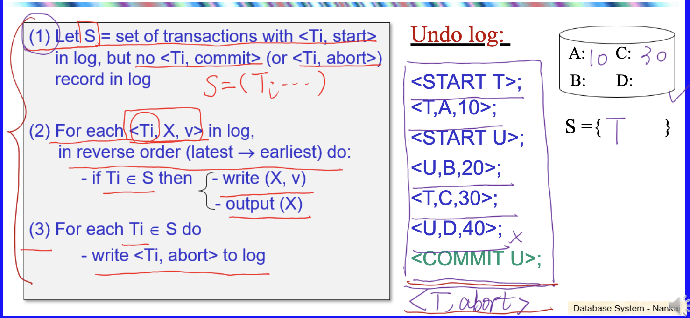
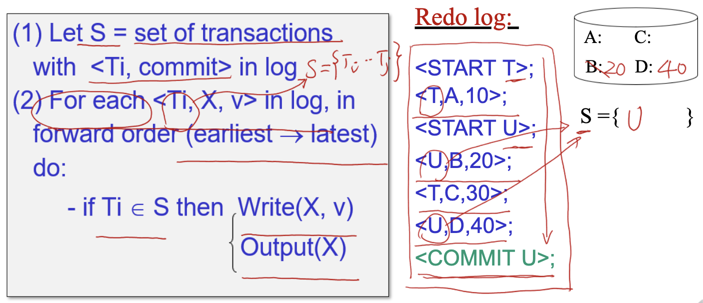
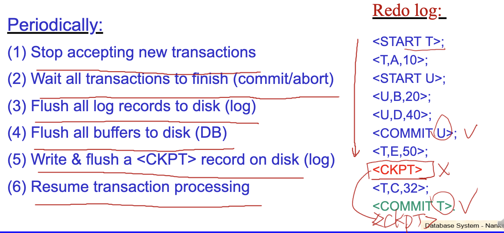

# Week14

主要内容：崩溃恢复

**所有操作先在内存进行。**

## 引言

我们数据库要保持什么样的状态：（`ACID`）

+ **原子性**：数据库的操作要么全部成功，要么全部失败
+ **一致性**：事务执行前后，数据库的数据必须保持一致的状态
+ **隔离性**：多个事务并发执行时，一个事务的执行不能被其他事务干扰
+ **持久性**：一旦事务提交，它对数据库的改变就应该永久保存下来

## Undo logging

当一个事务 $T$ (transaction)开始的时候，我们记录

$$<T,start>$$

然后我们想修改一个行$A$的值，涉及Output操作的时候，要先写入：

$$<T,A,old\_val>$$

当所有的磁盘修改工作完成之后，才能够写入：

$$<T,commit>$$

undo日志如果看到了结束标记，就不需要进行恢复，只有没有结束的事务才需要进行恢复。

+ undo日志数据库恢复：

查找磁盘上没有完成的事务，**从后向前将这个事务进行回滚**，对日志中所有的`<Ti , X , v>`恢复，并写回磁盘

当所有的回滚完成之后，将下面的**写入磁盘**：

$$<T,abort>$$

### 详细操作

+ `Log`**先记录在Memory中**，不需要每一步都写入磁盘
+ 所有的写盘的数据完成后，再写`Commit`

注意算法最后一步：`记录<T,abort>`

## Redo logging

+ 当OutPut的时候，必须先进行$<T_i,commit>$，并且将日志写入磁盘，然后再之行`Output`
  + $<T_i,X,new\_val>$，注意这里保存的是新的值

日志恢复算法：

但是上面的方法的效率比较慢，我们引入$<chck>$ - 就是检查点：

## Undo/Redo logging

我们记录的基本数据类型：

$$<T_i,X,v\_old,v\_new>$$

### 日志写入

+ 常规事务写入

当有OutPut操作时，先写入相关的$<T_i,X,v\_old,v\_new>$，然后再进行磁盘数据的修改。

事务按照内存中的顺序写入磁盘之后$<T_i,commit>$写入磁盘。但是**注意Output操作在$<T_i,commit>$之前之后都可以。**，即在此方法下不保证出现commit之前的日志操作都完成了写入磁盘。

+ 非静态检查点写入

在开始进行检查点的时候向磁盘写入`<START CKPT T1,...，Tn>`，**表示这些事务还在执行，没有完成**

将`<START CKPT T1...，Tn>`之前对元素的修改操作写入磁盘

**完成之后将`＜END CKPT>`写入磁盘**

!!! Warning "对`<END CKPT>`理解"
    如果没有出现`<END CKPT>`，说明`<Start CKPT>`之前的事务都不一定完成！

    发现`<END CKPT>`就知道与之对应的`<START CKPT T1,...,Tn>`之前的对数据的修改操作全部完成了，写入磁盘

### 按照日志进行崩溃恢复

本方法的**基本原理**：

+ 对**所有没有完成**的事务，**从后往前顺序回滚**
+ 对**所有完成**的事务，**从前往后的顺序执行重做**

从后向前找到**第一个有对应的**`<END CKPT>`的`<START CKPT T1，...、Tn>`，在这个区间内找到**所有未完成的事务进行回滚(undo)**，到检查点开始的位置，**对于那些尚处在活跃状态的事务要继续向前回滚**

从`<START CKPT T1,....，Tn>`向后，重做已经完成的事务
