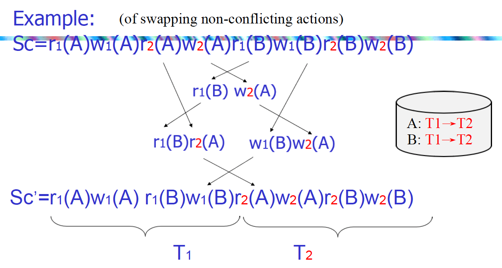

# Week15 Concurrency Control

## 调度 schedule

调度的含义：**一定是涉及多个事物**而不是一个事物的读写操作。

一个好的调度应该满足：

+ 不依赖数据库的初始状态
+ 不依赖事务语意

调度的正确性应该只关心READ/WRITE的顺序，不关系INPUT/OUTPUT的顺序，**也就是说只能够表现内存中的值**，而不是磁盘状态。

+ `Serial Schedule`: 串行调度，**按照事务的提交顺序执行事务**，即一个事务执行完了后执行下一个事务。

+ `Serializable schedule`: 可串行化调度，等价于串行调度的调度

冲突：在调度中如果调换了两个动作会改变调度的语义
对同一个事务任意两个动作都是冲突的
两个不同的事务对同一个元素的访问中有写操作

## 两端锁 Two Phase Locking

两阶段锁是一种基于锁的并发控制协议，它将事务分为两个阶段：

