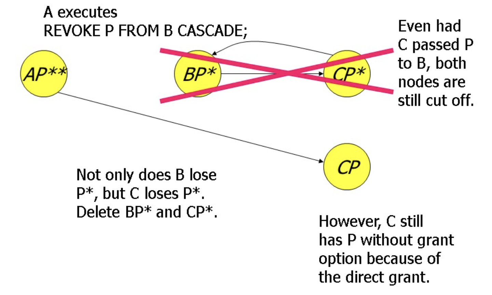

# SQL Advanced

## 数据库的修改（DB modification）

### 插入

首先是插入操作，我们可以插入一条信息，也可以通过查询的模式来进行插入。

```SQL
INSERT INTO table_name (column1, column2,...)
VALUES (value1, value2,...)
```

我们还可以往里面通过子查询的方式来插入数据。

### 删除

```SQL
DELETE FROM table_name
WHERE condition
```

这可以使整个表变空白，要注意的是，`DELETE FROM`和`DROP TABLE`是不一样的，一个是把表格删空，一个是直接把表格删没了

### 更新

```SQL
UPDATE DrinkersSET phone ='555-1212'
WHERE name ='Fred';
```

通过上面的`UPDATE`的语法，我们可以把`Fred`的电话修改为`555-1212`。

## 断言和触发器（Assertions and Triggers）

## 存储过程

## 视图

视图是从一个或几个基本表导出的虚拟表，可以简化用户查询操作，对数据提供安全保护。

```SQL
CREATE VIEW 视图名[（视图列名表）] AS 
[SELECT 语句]
[WITH CHECK OPTION]
```

+ SELECT 语句可以是任何复杂的SELCT语句，但是通常不允许使用`OREDR BY`排序
+ 视图列名表要么全部省略要么全部指定
+ WITH CHECK OPTION 用于触发器，当视图的数据发生变化时，触发器会自动执行

视图的查询和基本表的查询相同。
删除视图时，只会删除视图定义，而不影响基本表。

### 视图的更新

不是所有的视图都允许更新（一般要求单个基本表导出）

## SQL 授权

### 表上的重要权限

+ `SELECT`权限
+ `INSERT`权限
+ `UPDATE`权限
+ `DELETE`权限

一个用户创建的表就会对这个表拥有所有的权限。
用户可以通过`GRANT`机制来授权给其他用户

```SQL
GRANT <list of privileges> 
ON <relation or other object> 
TO <list of authorzation ID's>
```

我们通过一个例子来说明授权的语法：

```SQL
GRANT SELECT, UPDATE(Price)
ON Sells
TO sally
```

现在Sally有权利去执行任何查询并且只能更新价格。但是记得Sally不能把这个权利授予其他用户。

如果她需要给其他用户授权，需要在上面的授权语句中加上：

```SQL
WITH GRANT OPTION
```

## 回收权限 - Revoke

```SQL
REVOKE <list of privileges> 
ON <relation or other object> 
FROM <list of authorzation ID's>
```

但是你需要知道是，你收回了这个权限后，这个用户可能会从别的用户那里获得这个权限。

现在我们有两种回首权限的方式

+ `CASCADE` 代表级联，一旦发起者撤销权限，这样的话后面的所有人都会失去权限。 从你这端发散出去的某个权利全部被你回收。
+ `RESTRICT` 如果授权已经传给了其他人，这样我们的REVOKE就会失败

但是授权的过程是十分复杂的，我们引入授权图（Grant Diagram）来帮助理解。

## Grant Diagram

+ 节点：User/权限/option/isOwner？
  + 但是注意`UPDATE`和`UPDATE(Price)`不是一个节点，而是两个节点。
+ 边`X -> Y`：节点X完成了一次授权到Y

我们现在用 $AP$ 来表示用户A具有权限P：

+ $P^*$表示具有`WITH GRANT OPTION`的权限
+ $P^{**}$表明是用户A创建的对象

注意我们每次收回权限时候，需要检查每个节点的权限是否有来自双星节点的路径。如果没有，需要将不合理的变删除。



