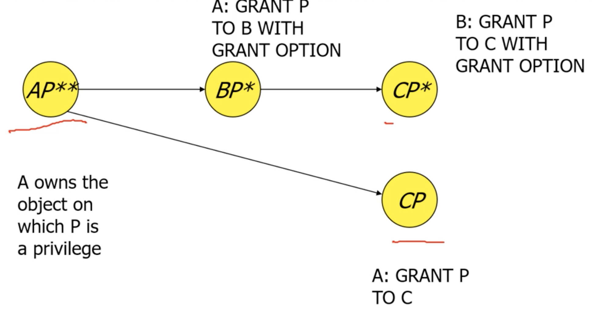

# 修改语句
## INSERT
## DELETE
## UPDATE

# Assertion断言

在MySQL中还不支持。
断言始终为真，当有操作导致断言为假时，操作会被拒绝。

## 创建断言
```SQL
CREATE ASSERTION <name> CHECK (<condition>);
```
## 删除断言
```SQL
DROP ASSERTION <name>;
```

# Trigger触发器
触发器是一个特殊的存储过程，它在特定事件发生时自动执行。触发器通常用于实现复杂的业务逻辑或数据验证。

AFTER触发器在指定事件（如INSERT、UPDATE或DELETE）之后执行，而BEFORE触发器在事件之前执行。

出现了NEW和OLD关键字，NEW表示新插入或更新的行，OLD表示被删除或更新的行。

## 创建触发器
```SQL
CREATE TRIGGER <trigger_name>
AFTER|BEFORE INSERT|UPDATE|DELETE ON <table_name>
FOR EACH ROW
BEGIN
    -- 触发器逻辑
END;
```
## 删除触发器
```SQL
DROP TRIGGER <trigger_name>;
```

# PROCEDURE存储过程
存储过程是一组预编译的SQL语句，可以通过调用来执行。存储过程可以接受参数，并且可以返回结果。
## 创建存储过程
```SQL
CREATE PROCEDURE <procedure_name>(<parameter_list>)
BEGIN
    -- 存储过程逻辑
END;
```
## 删除存储过程
```SQL
DROP PROCEDURE <procedure_name>;
```

# FUNCTION函数
函数是一种特殊的存储过程，它可以接受参数并返回一个值。函数通常用于计算或转换数据。
## 创建函数
```SQL
CREATE FUNCTION <function_name>(<parameter_list>)
RETURNS <data_type>
BEGIN
    -- 函数逻辑
    RETURN <value>;
END;
```
## 删除函数
```SQL
DROP FUNCTION <function_name>;
```

---
# 嵌入式SQL
嵌入式SQL是将SQL语句嵌入到其他编程语言（如C、Java等）中的一种方式。它允许程序员在应用程序中直接使用SQL语句来操作数据库。

# 建立视图

视图其实相当于预存了一个子查询语句，然后每次获取这个视图的时候，都帮你执行一次这个子查询。

视图在创建的时候不会执行查询，而是在每次访问视图时执行查询。

如果涉及的表被删除，那么这个视图也将不可用


```SQL
CREATE VIEW <view_name> 别名 (attr_list)
AS SELECT <columns>
FROM <table_name>
WHERE <condition>;
```
+ attr_list：视图的属性列表,要不全部不指定别名，要不就全部都起别名
+ 后面的select一般不能使用order by

## 视图的更新
对视图直接进行insert、delete、update操作时，MySQL会尝试将这些操作转换为对基础表的操作。

但是不是所有视图都能被更新

+ 单个表
+ 没有聚合函数、DISTINCT、GROUP BY、HAVING、UNION、LIMIT等
+ 没有计算列

注意，如果子查询里面带有where，当开启**CHECK OPTION**时，不符合where会导致视图更新失败。而没有开启时，照样会修改原表，但是不会在视图结果中出现

# 索引INDEX

用来加快查询速度

创建索引
```SQL
CREATE INDEX <index_name>
ON <table_name> (<column_name>);
```
删除索引
```SQL
DROP INDEX <index_name> ON <table_name>;
```

# 权限与授权

## 权限
+ SELECT：查询数据
+ INSERT：插入数据
+ UPDATE：更新数据，也可以只更新某个列，对某个列有权限
+ DELETE：删除数据

## 授权

GRANT OPTION

```SQL
GRANT <privilege(权限列表)> 
ON <database>.<table_name> 
TO '<user>'@'<host>'
WITH GRANT OPTION;
``` 

## 撤销授权
```SQL
REVOKE <privilege(权限列表)>
ON <database>.<table_name>
FROM '<user>'@'<host>';
```
+ CASCADE：如果有其他用户依赖于这个权限，那么会一并撤销
+ RESTRICT：如果有其他用户依赖于这个权限，那么会拒绝撤销

## 授权图



节点表示：
* AP代表A用户有P权限
* AP*代表A用户有P权限以及所有子权限，可以授权给其他用户
* AP**说明A是P权限的初始所有者