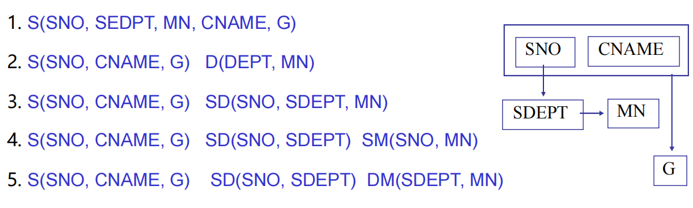
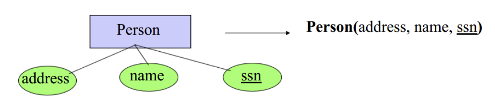
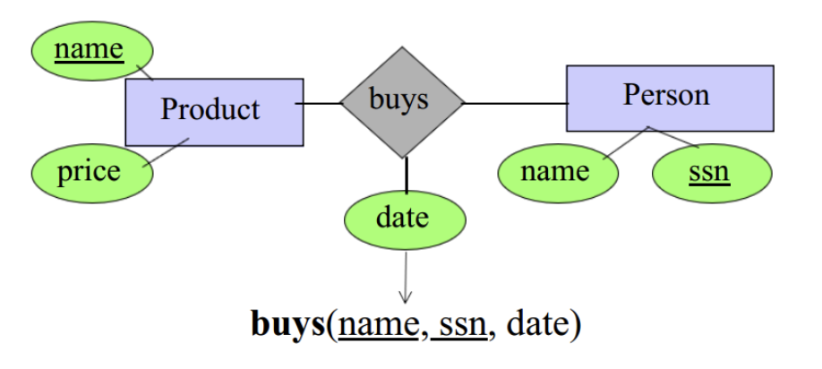
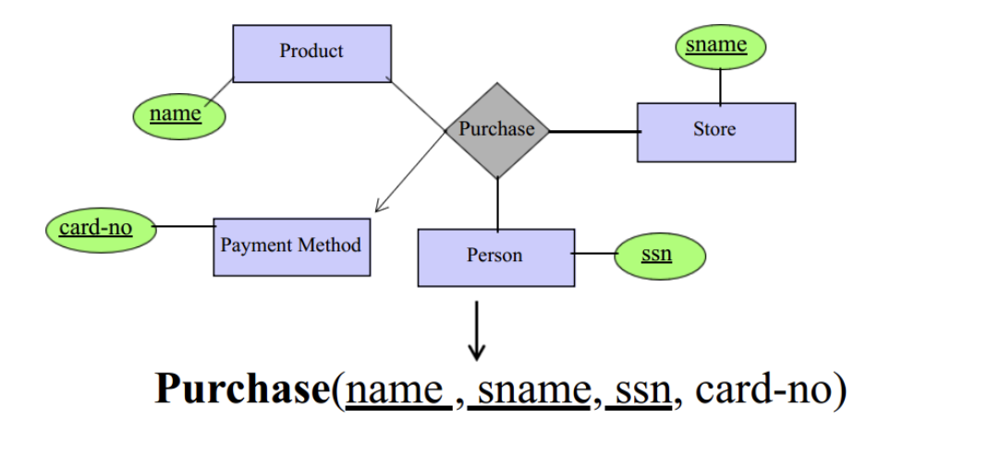

# Week 9: Schema Design

> 本周内容：模式设计与细化1-3、范式理论

## 模式设计动机（Motivation）

首先我们来关注设计存在问题的关系模式带来的一系列问题。

+ 冗余（Abundancy） -> **更新异常**（容易遗漏没有更新的条目），**删除异常**（可能会导致删除一个条目同时丢失了其他信息？可能会需要删除多次），**插入异常**（插入一个item同时需要插入多个item）

对于一张存在一系列问题的关系模式表，我们一般采取的方式就是**分表**，将表拆分减少冗余。

如上，第一个明显是冗余的。第二个模式明显又缺少关键信息。第三个和第四个模式又存在冗余。对于这种情景下，我们理想的模式设计应该是：5。

!!! Tip "冗余可以存在，但是重要的是减少冗余带来的一系列问题"
    冗余有时候是为了某些安全的目的，但是如果带来了其他问题。我们应该尽量减少冗余，而非增加冗余。

## 函数依赖(FD,Fucntional Dependency)与键

!!! Note "规律"
    **启发式规则1**：在所有函数依赖右边箭头指向部分没有出现的都是键的一部分
    **启发式规则2**：不在所有函数依赖左部分出现的一定不是键的一部分

函数依赖是指，存在一部分函数的约束，我们在进行拆表的时候必须将其考虑进去。

$$A \rightarrow B$$

这是一个函数约束，意思是说A确定的话，B也随之确定。

+ 函数依赖就是一种**多对一的关系**

和函数依赖有关的一个概念，**键（key）**，可以通过函数依赖决定关系$R$中的所有属性。

$$1.\;Key \rightarrow \{A,B,C,D,E\}$$

$$2.\;Key_{subset} \nrightarrow \{A,B,C,D,E\}$$

$$3.\;Key的超集是superkey$$

> 由于第二条性质，所以我们确定key是最小满足R关系的所有属性函数依赖的**最小集合**。

!!! Note "如何寻找函数关系的键"
    + 如果是实体集合，那么我们的键就是实体集合的键
    
    + 如果关系来自多对多关系，则关系的键是与实体集对应的关系中所有属性键的集合
    
    + 如果关系上有箭头的话，我们就不需要将其计算为我们的主键
    

### 用函数依赖推理

> + **Reflexivity rule** 自反律: $A \rightarrow B,C,D \Rightarrow A \rightarrow B, A \rightarrow C, A \rightarrow D$
> + **Argumentation rule** 增广律: $A_1A_2 \rightarrow B \Rightarrow A_1A_2C \rightarrow BC$
> + **Transitivity rule** 传递律: $A \rightarrow B, B \rightarrow C \Rightarrow A \rightarrow C$
> + **Union rule** 结合律：$A \rightarrow B, A \rightarrow C \Rightarrow A \rightarrow BC$
> + **Decomposition rule** 分解律：$A \rightarrow BC \Rightarrow A \rightarrow B, A \rightarrow C$
> + **Pseudo-transitivity rule** 伪传递律：$A \rightarrow B,BC \rightarrow D \Rightarrow AC\rightarrow D$

定义：函数闭包$S^+$，里面包含**所有能够通过函数依赖推导出的关系集合**，可以使用ArmStrong公理推导我们的函数闭包。

### 属性闭包的用法

1. 判断属性组合是不是超键
2. 判断函数依赖($A\rightarrow B$)是否被蕴含，只需要计算$B$在不在$A$的闭包里面
3. 求函数依赖关系的闭包。先求出所有属性子集$X$的$X^+$，然后计算$X^+$的子集$Y$，输出所有的$X \rightarrow Y$
