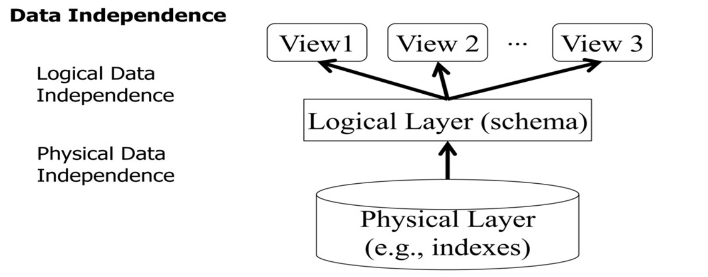

# DataBase System

> 主要内容：数据库的介绍、DBMS、数据模型、DDL&DML、数据独立性

## Basic Concepts

+ **DBMS**：Data Base Management System（数据库管理系统，用于管理数据）
+ **DataBase System**：DBMS + data + application programmes(数据库系统=数据库管理系统+数据+应用程序)
+ **metadata**（元数据）：关于数据描述的数据
+ **Data Model**（数据模型）：数据库中的数据是按照一定的逻辑结构存放的，这种结构称之为数据模型
+ **数据项**：数据库中最小的单位，比如说成绩中的99
+ **Schema** (模式)：装配数据的框架

现在我们给出数据库系统的形式示意图，帮助你更好地理解：


通过这张图片，我们简单介绍下DBMS的工作方式。
**DBMS**一般作为用户和数据之间的**中间件**，上面的用户可以用来查询数据，有很多方式例如插入、删除、查询等，下面是**数据字典**（catalog、metadata，data-dicitionary）。

我们在构造DBMS的过程中需要注意以下方面：

+ 数据项的存储
+ 数据项的操作
+ 数据的并发控制
+ 数据库恢复

## Data Model

我们数据模型一共有常见的五种方式，需要学会区分开它们：

+ XML数据模型
+ 面向对象模型
+ **关系模型**：**表格**表示实体和实体之间关系或则会无向图
+ **网状模型**：**有向图**表示实体和实体之间的联系
+ **层次模型**：用**树状**【child-parent层次】结构来组织数据，例如我们一般可以是使用层次模型来对学校某个系的组织结构建模

### Relation,Relation Schema,Relation Model

> 基本概念介绍
>
> + **Relation** (关系$R$)：现实中实体与实体间的各种联系均用关系来表示
>   + **tuple** (元组)：关系中每个元素叫作一个n元组，简称元组
>   + **attribute** (属性$A$)：表中的一列即为一个属性，给每个属性起一个名称即为属性名，表中任意的属性名不能相同
>   + 码
> + **Relation Schema** (关系模式)：一般形式化为$R(A_1,A_2,...,A_n)$,是对关系的描述，关系模式定义了表的结构，包括表名和属性名。例如，学生表的关系模式可以表示为学生（学号，姓名，性别）
> + **Relation Model** (关系模型)：关系模型由关系数据结构,关系操作集合,关系完整性约束三部分组成.
> + **Relation DataBase** (关系数据库)：在一个给定的应用领域中，**所有关系的集合**构成一个关系数据库。

一个关系对应一张二维表，表中的每一行代表一个元组，每一列代表一个属性。

!!! Note "关系和关系模式的区别"
    + **关系模式是型,关系是值**,关系模式是对关系的描述
    + 关系是关系模式在某一个时刻的状态或者内容,关系模式是静态的,稳定的,而关系是动态的,随时间不断变化的,因为关系操作在不断地更新着数据库中的数据
    + 类似于面向对象程序设计中”类“与”对象“的区别。”关系“是”关系模式“的一个实例，可以把”关系”理解为一张带数据的表，而“关系模式”是这张数据表的表结构。

### DDL,DML

DDL就是数据定义语言，就是改动原来的表的结构与模式，而不对具体的存储的数据进行修改。

```SQL
create table student(
    学号 char(8) primarykey,
    姓名 char(8),
    出生日期 date,
    所属学院 varchar(30)
)
```

DML就是数据管理语言，就是要改动原来的数据内容，比如说将某一个格子里的值进行修改。

```SQL
insert into student values('20161001','张三','1994.08.05','数学')
```

## Data Independence



第一层是**外模式、子模式、用户模式**，就是用户空余看到的部分；
第二层是**模式（逻辑模式）**，就是中间层；
第三层是**物理模式、内模式、存储模式**

**两个独立**：

+ **逻辑独立**：位于逻辑模式与外模式之间，内容是：加上一列数据，对于外部的用户也不会知道其变化，相当于把内部的操作与外部的进行了独立。**相当于保护了在逻辑模式中进行的修改**。
+ **物理独立**：位于逻辑模式与内模式之间，内容是：作为中间层，我们不需要知道我们是怎么存储数据的，不需要知道先存行还是列，只需要知道最后存储成为了一张表就可以了。**相当于保护了物理层面的改变**。
