# Relation Algebra

> 主要内容：关系代数的运算

## 交集、并集与差集

首先是最基础的三种关系代数，分别是交集、并集和差集

$$R := R_1 \cup R_2$$

$$R := R_1 \cap R_2$$

$$R := R_1 - R_2$$

需要注意的是，我们做**运算的前面的与后面的关系模式需要相同**，不然不能做关系运算。

## 笛卡尔积

$$R := R_1 \times R_2$$

我们做笛卡尔积运算，就是说将两边的属性都合在一起，如果有重名的情况，我们就需要用 $R_1.A$ 和 $R_2.A$ 来区分。

## 选择

$$R_1 := \sigma_C(R_2)$$

这个运算就是说，我们从$R_2$中选择我们所需要的，条件就是我们写在下标的$C$

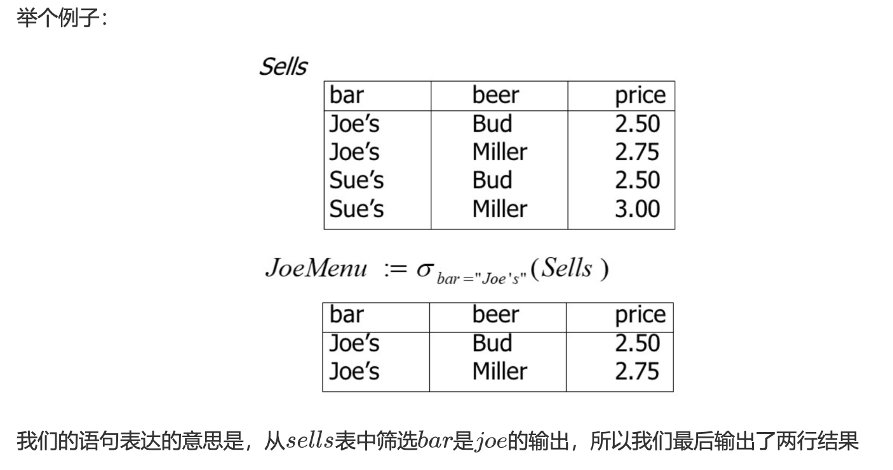

## 投影

$$R_1 := \Pi_{L}(R_2)$$

选择我们需要的列进行输出，注意我们在输出的时候**会进行去重操作**。

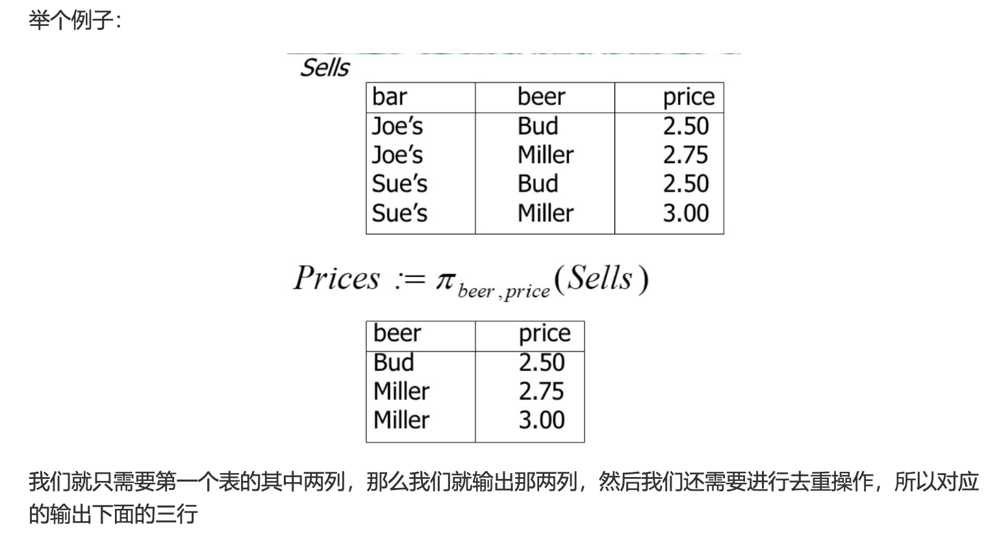

## 条件连接(易错，需要区分自然链接)

$$R_3 := R_1 \bowtie_{C} R_2$$

我们先对两部分做笛卡尔积，然后我们再根据给出的条件去筛选我们所需要的值。

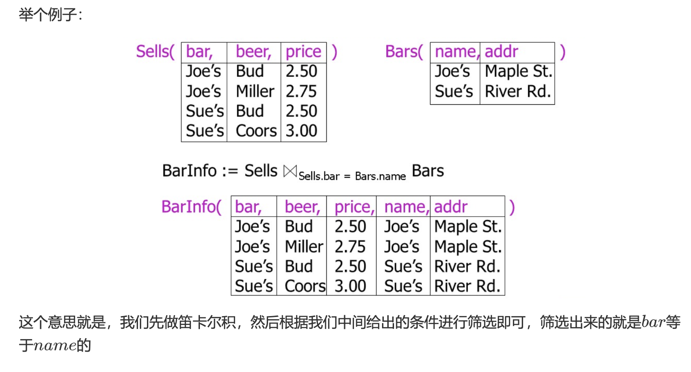

## 自然连接

$$R_3 := R_1 \bowtie R_2$$

我们将两个表通过自然连接的方式连接在一起，会去除某些重复的关系属性

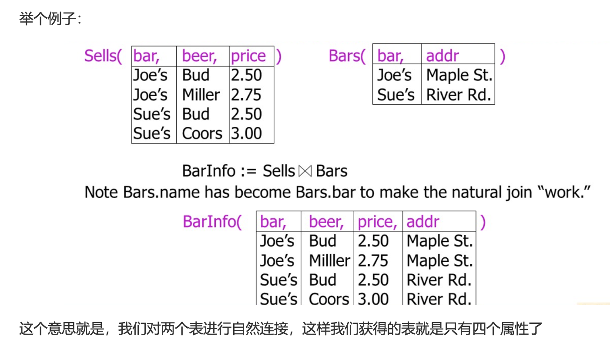

## 重命名

$$R_1 := \rho_{R_1(A_1, A_2, \cdots, A_n)}(R_2)$$

我们就可以做到将$R_2$的名字用我们给出的模式来命名，并且赋值给$R_1$

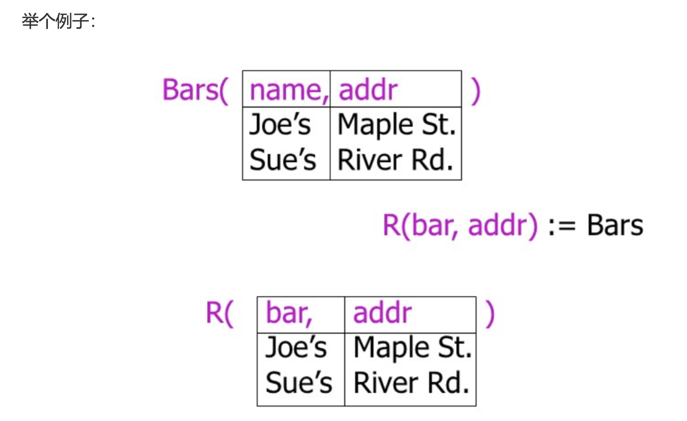

## 表达式树

我们可以用表达式树的方式来记录我们运算的顺序

举个例子：

我们可以使用以下的表达式树来运算

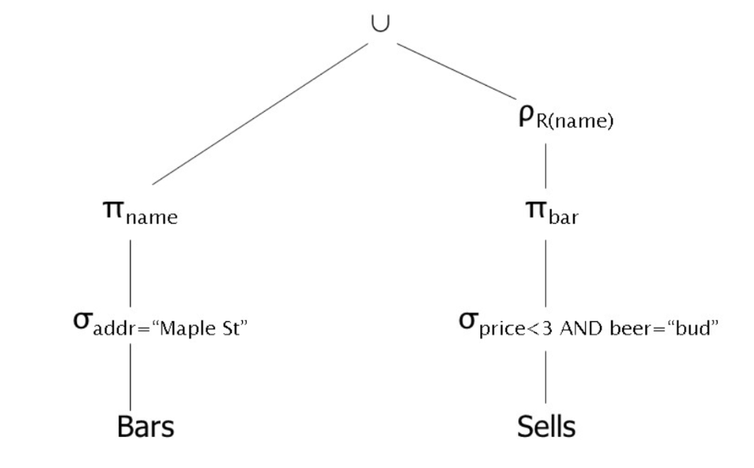

注意，运算顺序是从下面开始，到上面结束（构建表达式树的技巧，然后做自然链接、合并前一般可能需要重命名）

那么我们进行上述运算时，会不会对我们本身的模式造成改变呢？

**首先，最基础的三类运算肯定是不会发生改变的，然后选择操作也是不改变的，但是映射操作会改变我们的关系模式；后面的所有操作都会影响到我们的关系模式**

## 去重(delta)

对表操作，相当于SQL中的`DISTINCT`，去掉重复的行。

$$R1 := \delta(R2)$$

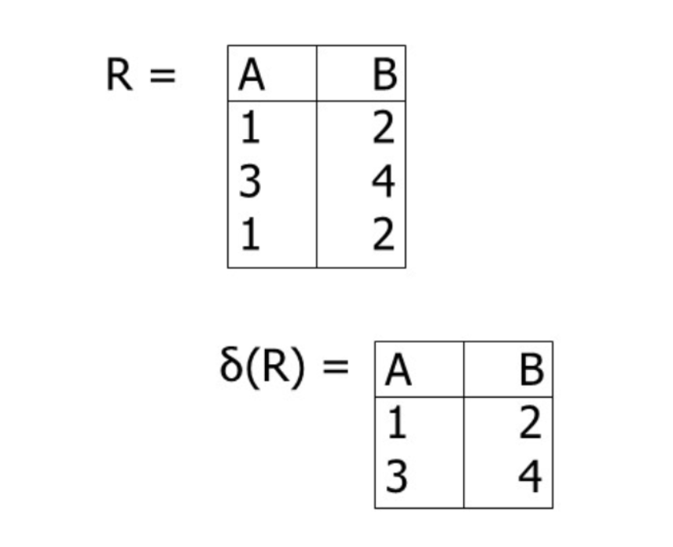

## 排序（TAU）

$$R1 := \tau_{L}(R2)$$

我们的TAU下面的下标是，我们对应的排序关键词，按照顺序进行排序即可，下标对应的就是对应列的属性。

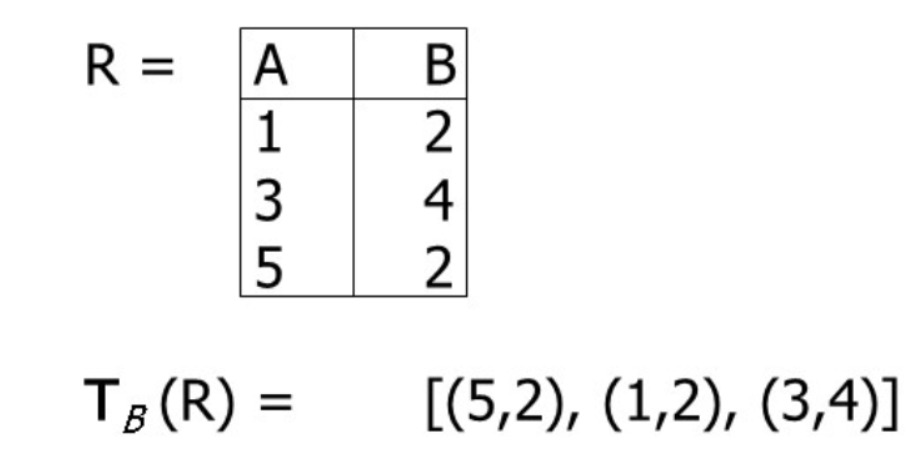

## 广义投影

跟TAU语句是一样的，我们可以根据已有的列属性去构造新的属性，举个例子:

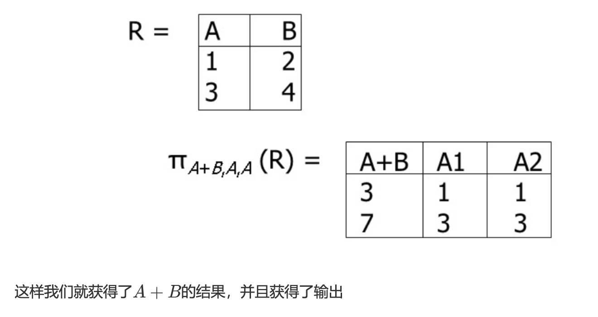

## 聚合（GAMMA）

我们使用以下的查询：

$$R1 := \gamma_{L}(R2)$$

$L$是指我们需要按照那个属性进行分组，我们在$L$处只能放两种东西：**一个是分组属性；一个是每一个分组属性的聚合运算**

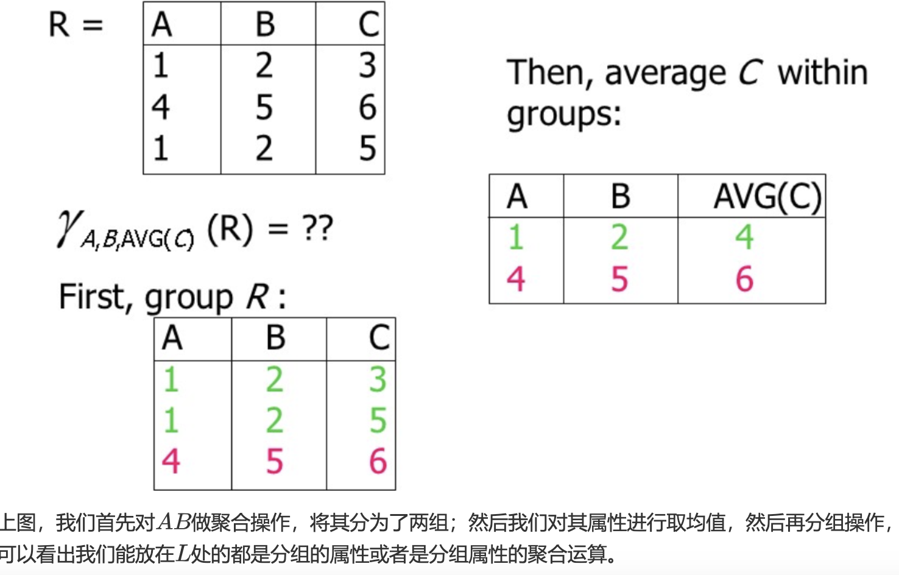

## 外连接

为了避免出现做自然连接的时候连接不上，我们使用外连接来解决这个问题。

## 除法(DIV)

$$R \div S$$

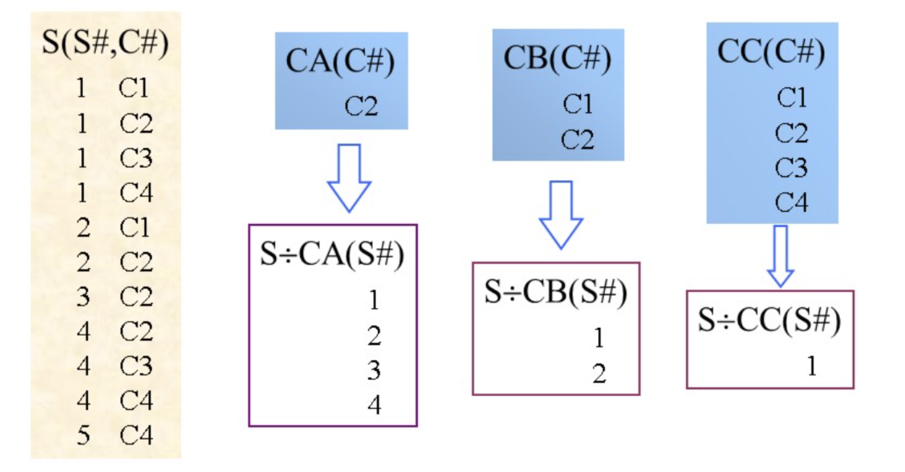

我们通过一个例子了解除法的运算

1. 首先计算差集：$R - S = \{S\#\}$，在R中有的但是在S中没有的。
2. 然后计算交集：$R \cap S = \{C\#\}$，在R和S中都有的。

至此我们可以确定我们的结果表格里只有一个属性 `S#`

然后我们收集所有种类的`S#`

|`S#`|所对应到的所有种类的`C#`|
|:---:|:---:|
|1|C1,C2,C3,C4|
|2|C1,C2|
|3|C2|
|4|C2,C3,C4|
|5|C4|

然后观察哪些`S#`在交集中的覆盖情况，如果全部覆盖交集，那么我们就把`S#`作为一个属性。

## 关系代数的优先级
1. 一元优先级最高：重命名、投影、选择
2. 其次，笛卡尔积和连接运算
3. 交集
4. 并集、差集

---

## 总结

人们证明了$\cup$（并集）,$-$（差）,$\times$（笛卡尔）,$\sigma$（选择）,$\pi$（投影）是最小完备子集