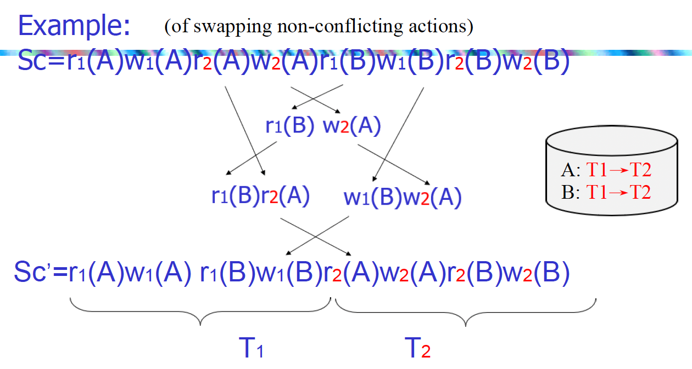
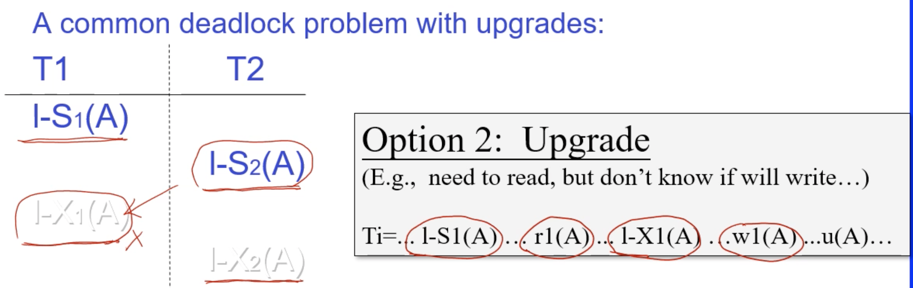
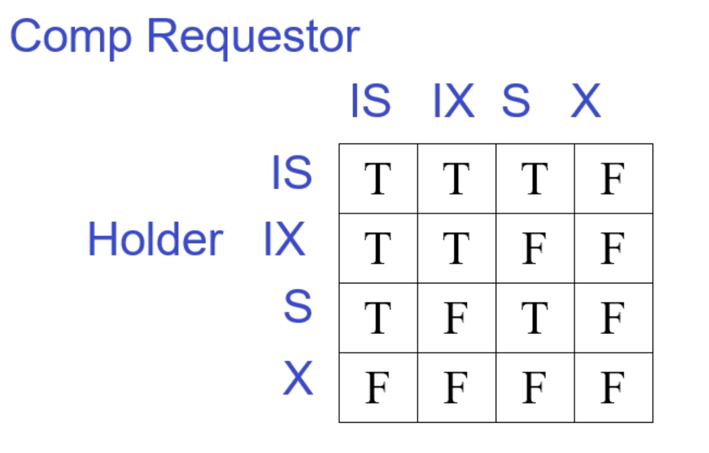

# Week15 Concurrency Control

## 调度 schedule

调度的含义：**一定是涉及多个事物**而不是一个事物的读写操作。

一个好的调度应该满足：

+ 不依赖数据库的初始状态
+ 不依赖事务语意

调度的正确性应该只关心READ/WRITE的顺序，不关系INPUT/OUTPUT的顺序，**也就是说只能够表现内存中的值**，而不是磁盘状态。

+ `Serial Schedule`: 串行调度，**按照事务的提交顺序执行事务**，即一个事务执行完了后执行下一个事务。

+ `Serializable schedule`: 可串行化调度，等价于串行调度的调度

冲突：在调度中如果调换了两个动作会改变调度的语义
对同一个事务任意两个动作都是冲突的
两个不同的事务对同一个元素的访问中有写操作

* 串行调度
* 等价调度
* 可串行化调度

冲突等价：指两个调度关系调换某些关系之后，最终的冲突长的一样

冲突等价 => 调度图一样
调度图一样 ≠> 冲突等价
调度图有环 <=> 不可串行化调度

## 数据库系统如何强制实施可串行化调度

1. 乐观策略

任何行为都允许，一致记录调度图，一旦出现环，就会滚

2. 悲观策略

满足不出现环的才会实现，否则会等待。

在数据库中会有一个调度器，用来上锁

## 两端锁 Two Phase Locking

两阶段锁是一种基于锁的并发控制协议，它将事务分为两个阶段：

## 三个规则

1. **well-formed transactions** 

对一个数据读写的时候，在前面要先加锁，后面要解锁

2. **legal scheduler**

在一个事务对数据进行加锁解锁期间，不能有另一个事务在加这个同样的锁

3. **Two Phase Locking**
  
在一个事务的开始，统一一次性加锁，直到事务结束才一起解锁。就是一旦有解锁了，后面就不能再加锁了。

满足上面1、3条件，那么就是一个可串行化调度

## 死锁的预防

+ **一次加锁法**
  
  当一个事务开始执行的时候，对它要访问的所有元素全部先上锁。但是这样会导致并发度降低。
+ **顺序加锁法**
  
  所有事务按照某种顺序加锁，避免死锁的发生。但是维护成本高。
  
以上两种方法一般不使用，都是用**等待加锁法**。

## 共享锁

升级锁的操作也只能在两端锁的加锁阶段进行

## 更新锁

升级读锁为写锁可能会导致死锁。

我们不直接申请写锁，而是申请一个更新锁，表示我们要对这个数据进行修改，但是还没有修改。当所有读锁释放之后，就可以升级了。当存在更新锁，其他事务无法在申请这个更细锁。

## 工程上实现两段锁

在上锁阶段之一直不释放，直到所有执行完成之后一起释放

## 意向锁 IS/IX
意向锁就是，对这个粗粒度范围里面有一个细粒度操作，那么在这个粗粒度范围里直接上一个意向锁，这样就不能对这个粗粒度上锁。

比如我对表里面的某个行上了写锁，那么我要对这个表上一个意向锁，此时，不可以再对这个表上锁。

### warning Protocol
要对路径上的所有祖先都上意向锁

### 意向锁的兼容矩阵

### 插入删除操作的意向锁
插入的时候，要对父亲直接上写锁

删除的时候，对目标节点上写锁，对祖先节点上意向锁