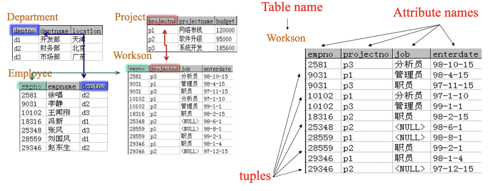
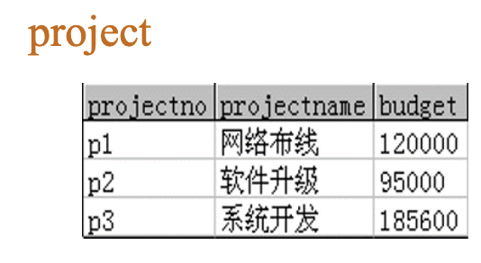
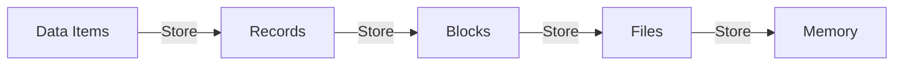
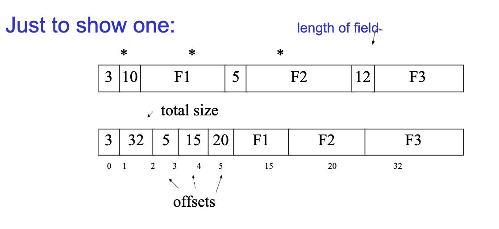
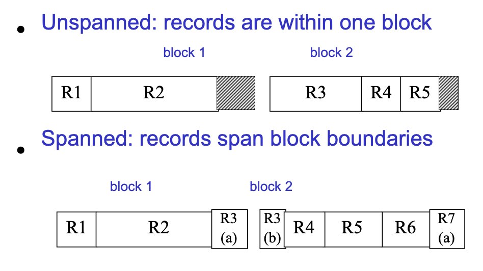

# Relation Model

> 本次笔记指引：
>
> + 关系模式与关系
> + 属性(Attribute) -> 字段(Field)
> + 元组(Tuple) -> 记录·行(Record·Row)
> + 记录集合 -> 存储块(Storage Block)
> + 块的集合 -> 存储关系(Storage Relation)

## 关系模式与关系

我们逐一阐述相关概念：

+ `Tables`对应`Relations`
+ `Columns`对应`Attributes`
+ `Rows`对应`Tuples`
+ `Schema`的一个例子是：`(Workson = (empno,projectno,job,enterdate))`

我们怎么准确地把握**关系**（Relation）的概念

$$S\# = \{S_1, S_2,..., S_m\}$$

$$C\# = \{C_1, C_2,..., C_n\}$$

$$G = \{1,2,...,100 \} $$

$$SCGG = S\# \times C\# \times G \times G$$

$$SCGG = \{(S_1, C_1, 85,92), (S_1, C_2, 85,92), (S_2, C_1, 75,82), (S_2, C_2, 75,82),... \}$$

$$Realtion: SC \subseteq SCGG$$

!!! Question "例题1"
    
    + **`Relaion`** : $project \subseteq String \times String \times Integer$
    + **`Tuple`** : `t = ("p1","网络布线",95000)`
    + **`Schema`** : `project: {[projectno:string,projectname:string,budget:integer]}`

## Keys 键

+ `Primary Key`(**主键、主码**)：唯一标识一条记录的属性或属性组，通常由一个或多个属性组成。
+ `Candidate Key`(**候选键**)：最小的superkeys

> 最小性：任一候选键的任何真子集都不能唯一标识一个记录

+ `Super Key`(**超键**)：对应表格中的某个列集合中任何两行不重复（具体界定，就是某一行组成的元祖turple不重复）
+ `Foreign keys`(**外键**)：如果关系模式R1中的某属性集不是R1的主键，而是另一个关系R2的主键则该属性集是关系模式R1的外键。

!!! Note "两个完整性"
    **实体完整性**（Entity Integrity）：表现为主键不允许为空，不允许重复
    **参照完整性**（Referential Integrity）：表现为**外键如果取值**，一定是要取主键中出现的值「**注意可以取空值**」

## DataLayout

数据存储：先在数据项（最小单元），然后存储到记录里，然后在存储到磁盘中，再存储到文件里，最后写入内存。

### Records

+ `Data Items` - 数值型、日期型、字符型
+ `Format` - **格式：固定/可变，长度：固定/可变**
+ `Blocks`：we will place records into blocks

关于记录的存储方式：

这里体现了数据与程序之间物理独立性，多个物理存储方式不影响逻辑表现。

### Blocks Store

1. Separating records

> 需要记录的东西大于一个Block的大小，这个时候就需要跨块去记录这个东西

2. Spanned vs.Unspanned
   1. Spanned: 记录跨块存储（分布于多个块存储），一般来说是Record Size > Block Size
   1. Unspanned: records are within one block

3. Mixed record types: records of different types,allowed in same block.

> SQL 数据页
>
> + 数据页是8k，包括三个部分，包括页头、数据行与行偏移数组页头占字节
> + 页头96个字节
> + 数据行，最大长度8060字节
>   + 数据行不能跨页存储
> + 行偏移存储，每行两个字节

### Rows & Columns Store

