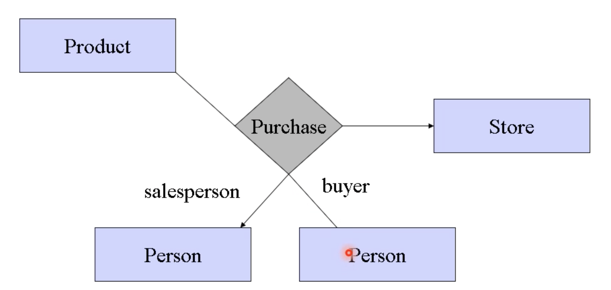
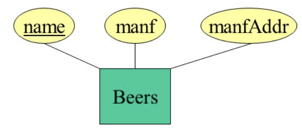

# Week4 ERmodel

> ER模型、ER模型的约束、ER图形的绘制原则

## Basic Stuff

> **概念数据模型**是现实世界到信息世界的第一层抽象，与DBMS无关
> PowerDesigner

+ Entity Seys 实体集合
  + **Entity** = thing or object
  + Entity Set = collection of similar enetities(实体集是相似实体的集合)
  + **Attribute** = property of an enetity set，一般要求简单数据类型，例如不可以是整数数组
+ Relationship Set 关系集合

在ER Diagrames中，实体集合是用矩形表达。属性是用椭圆形表达。
关系可以连接在两个实体之间，表示两个实体之间存在着一定的关系，是用菱形表达。
**关系也可以添加属性**。

|Object|Format Expression|
|:---:|:---:|
|实体集合|矩形|
|属性|椭圆形|
|关系|菱形|
|子类|三角形|
|弱实体集合|双线形|

## Relationship

### Mutiplicity of ER relationship

+ one to one：从左到右，从右到左都是多对一的关系

+ many to one：`多`的一方**至多**对应`一`的那一方中的一个元素

+ many to many

### Mutiway Relationships

### 共享实体集合

对于buyer属性和saleeperson属性，定义域都是Person集合里面的，可以表示成下面这样

原版本为

### Subclass

> 比如设想一个情况，我们需要设计一个学生类，比如说我们要设计一个学生信息管理系统，考虑到有本科生和研究生是有些不同但也有些相同，这个时候我们需要定义一个学生类

$subclass = special case = fewer entities = more properties$

这意味着，作为子类，我们的实体数量更少了，但是我们的属性就更多了！

举个例子，上图中$beer$作为父类，$Ales$作为子类，中间使用$isa$来进行连接，其中，$isa$表示两者之间的关系，三角形尖端指向父类，另外一端指向子类，相当于子类的属性应该是自身所带的和父类所带的属性之和。

公共信息放在父类表中，特殊信息放在子类表中。

## Constraints

常见的约束：

+ $key$：主键约束，主键一般唯一的确定一行数据，**我们需要为每一个实体集合【矩形】指定一个主键**，体现在ER diagram中就是在对应的属性**下方下划线**
  + 一个key上可以包括多个属性
  + 一个实体集合上可以有多个key

> 考虑到可能有子类-父类的ER图中，我们一般只在父类的属性中标记主键，而不在子类中标记

!!! Tip "Weak Entity Sets"
    **弱实体集合**，使用双线矩形表达，一般是自身集合的主键不足以唯一确定一个实例。
    为了解决这个弱实体集合的问题，我们使用多对一关系中`一`的那一方来支持弱实体集合。是用多对一另一方的主键和自己原来的主键作为自己的新主键。

    

    上面的图示中，可以看出弱实体集合具有**向后传播性**。

## Design principle

1. Be Faithful：如实反映需求

2. Avoid redundancy：避免冗余

3. Don't use an entity set when an attribute can do，entity set至少满足下面两个条件之一
   1. 多对一、多对多的`多`方的实体集合可以只有一个属性
   2. 不止是某个东西的名字，至少还有一个nonkey attribute

4. Limit the Use of Weak Entity Set

**我们首先重点关注冗余的部分**。

第一种形式的冗余 - 属性多次出现在ER图中（如下，`manf`两次出现在ER图中）

第二种形式的冗余 - 对于同一实体集合属性累赘（对于manfaddr就是冗余了，并且从删除操作上来说容易出错）

