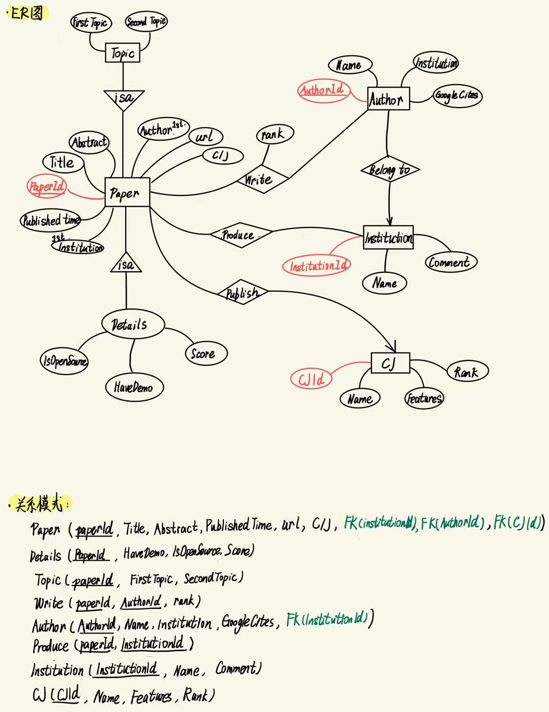
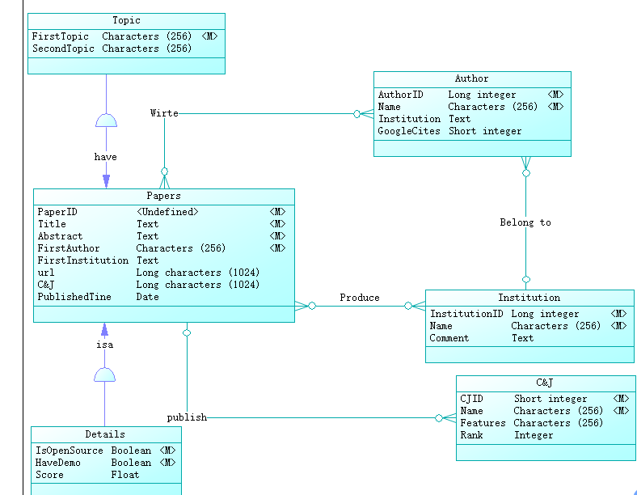
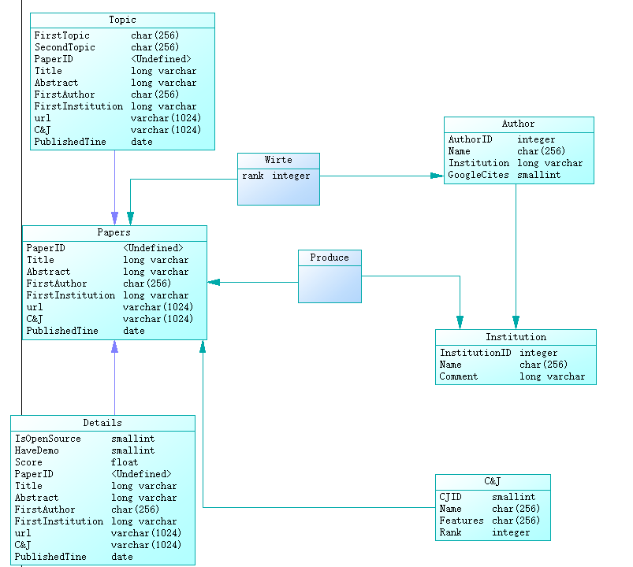

# 期末作业初期调研设计

> 这个初步调研设计会最终应用到很多地方，起源于我们课题组`减论`的开发需求，就是论文推荐响应数据库系统设计，我们的愿景是希望在新一轮搜索方式迭代下，能够快速、准确地为我们的论文推荐模型提供论文数据。
> **为什么我们觉得这个值得设计？**
> 对于当下科研工作者来说，现在是信息爆炸的时代，根据CorNell University的新闻报道：2022年1月，arXiv论文总数突破200万篇。前100万篇用了23.5年（1991-2014），而后100万篇仅用了7年（2015-2022），预计未来300万篇可能只需4.5年。寻找前沿的、高价值的前沿文章的难度不断增加，人工寻找的时间代价越来越高。所以，如何快速、准确地为用户推荐高价值的论文，是我们课题组一直在思考的问题。
> 一个好的模型一定有一个好的数据集/数据库作为支撑，所以我们初期去调研，去解决这样一个问题：根据用户的搜索需求，我们怎么快速地对有几十万数据条目的数据库按照相似度进行快速排序。但是现在，我们第一个难点就是，这个数据库怎么能够快速地响应查询要求从海量数据给我们需要的数据。

## 需求分析

用户侧（科研工作者、学生等）：

- 用户输入search query，希望得到相关的论文推荐。
- 用户可以选择不同的排序方式，比如按照相关性、时间、作者、引用次数等。
- 用户可以选择不同的主题，比如计算机理论、计算机系统、机器学习算法等等
- 用户一般需要系统返回给用户推荐一篇论文的理由[1]，为什么这篇文章值得推荐。就是综合推荐论文排序的依据可能需要一个指标或者分数来衡量。

!!! Note "关于这个指标的分析"
    我们如何认为一篇论文是更值得读的：
    + **相关性**：一篇论文的相关性越高，说明这篇论文和用户的搜索需求越相关。相关性需要**调研论文的标题、摘要、关键词**等等。
    + **强作者**：被**引用次数**高的作者，说明学术工作得到广泛认可
    + **工作开源程度**：开源的工作，说明作者对研究工作的透明度越高，说明这篇论文的价值越高。
    + **强课题组/团队/研究机构背书**：作者declare的研究课题组、团队、研究机构如果很厉害的话，说明这篇论文的价值越高。
    + **论文自身的被引用次数、所属于的会议/期刊层次**

会议期刊提供侧：

- 会议期刊提供论文数据，包括论文的标题、摘要、作者、发表时间、引用次数等。
- 会议期刊提供论文的关键词，方便我们进行论文的相似度计算。

## ER图设计

**实体**：

- 文章（Paper）
  - `Paper(*PaperId,Title,Abstract,PublishedTime,Authors,Topics,Conference/Journal,Institution,url)`
- 作者信息（Author）
  - `Author(*AuthorId,Name,Institution、GoogleScholarCiteCount)`
- 会议/期刊信息（Conference/Journal）
  - `CJ(*CJId,Name,Features,Rank)`
- 研究机构信息（Institution）
  - `Institution(*InstitutionId,Name,Comment)`
- 主题库（Topics，可以设计为文章子类）,设计为两级数据库
  - `Topic(Topic1,Topic2)`
- 开源信息库（Opensource,文章子类）
  - `Opensource(HaveCode,CodeRepository,HaveDemo,DeomLink,OtherInfo,url)`



## 关系模式

下面使用`*`装饰主键，使用`FK`装饰外键

- `Paper(*paperID,Title,Abstract,PublishedTime,FK(FirstAuthorID),Topics,Conference/Journal,FK(FirstInstitutionID),url),FK(CJID)`
- `Details(*PaperID,HaveDemo,IsOpenAccess,Score)`
- `Author(*AuthorID,Name,Institution,GoogleScholarCiteCount),FK(InstitutionID)`
- `Institution(*InstitutionID,Name,Comment)`
- `CJ(*CJID,Name,Features,Rank)`
- `Topic(Topic1,Topic2)`
- `Produce(*paperID,*InstitutionID)`
- `Write(*paperID,*AuthorID,rank)`

```SQL
-- Institution 表
CREATE TABLE Institution (
    InstitutionID INT PRIMARY KEY,
    Name VARCHAR(255),
    Comment TEXT
);

-- Author 表
CREATE TABLE Author (
    AuthorID INT PRIMARY KEY,
    Name VARCHAR(255),
    Institution VARCHAR(255),
    GoogleScholarCiteCount INT,
    InstitutionID INT,
    FOREIGN KEY (InstitutionID) REFERENCES Institution(InstitutionID)
);

-- CJ 表（Conference/Journal）
CREATE TABLE CJ (
    CJID INT PRIMARY KEY,
    Name VARCHAR(255),
    Features TEXT,
    Rank VARCHAR(50)
);

-- Paper 表
CREATE TABLE Paper (
    paperID INT PRIMARY KEY,
    Title VARCHAR(255),
    Abstract TEXT,
    PublishedTime DATE,
    FirstAuthorID INT,
    Topics VARCHAR(255),
    `Conference/Journal` VARCHAR(255),
    FirstInstitutionID INT,
    url VARCHAR(255),
    CJID INT,
    FOREIGN KEY (FirstAuthorID) REFERENCES Author(AuthorID),
    FOREIGN KEY (FirstInstitutionID) REFERENCES Institution(InstitutionID),
    FOREIGN KEY (CJID) REFERENCES CJ(CJID)
);

-- Details 表
CREATE TABLE Details (
    PaperID INT PRIMARY KEY,
    HaveDemo BOOLEAN,
    IsOpenAccess BOOLEAN,
    Score DECIMAL(5,2),
    FOREIGN KEY (PaperID) REFERENCES Paper(paperID)
);

-- Topic 表（如果是 topic 的映射关系）
CREATE TABLE Topic (
    Topic1 VARCHAR(255),
    Topic2 VARCHAR(255)
);

-- Produce 表（Paper 与 Institution 的关系）
CREATE TABLE Produce (
    paperID INT,
    InstitutionID INT,
    PRIMARY KEY (paperID, InstitutionID),
    FOREIGN KEY (paperID) REFERENCES Paper(paperID),
    FOREIGN KEY (InstitutionID) REFERENCES Institution(InstitutionID)
);

-- Write 表（Paper 与 Author 的关系）
CREATE TABLE Write (
    paperID INT,
    AuthorID INT,
    rank INT,
    PRIMARY KEY (paperID, AuthorID),
    FOREIGN KEY (paperID) REFERENCES Paper(paperID),
    FOREIGN KEY (AuthorID) REFERENCES Author(AuthorID)
);

```

## 五个查询示例

查询样例 1：查询所有发表在 Rank 为 "A" 的会议/期刊上的论文标题和对应的分数

```sql
SELECT P.Title, D.Score
FROM Paper P
JOIN CJ C ON P.CJID = C.CJID
JOIN Details D ON P.paperID = D.PaperID
WHERE C.Rank = 'A';
```

查询样例 2：查询某位作者（AuthorID=1）参与的所有论文标题及其在论文中的作者排序

```sql
SELECT P.Title, W.rank
FROM Write W
JOIN Paper P ON W.paperID = P.paperID
WHERE W.AuthorID = 1
ORDER BY W.rank ASC;
```

查询样例 3：查询所有开放获取（Open Access）且有 Demo 的论文标题

```sql
SELECT P.Title
FROM Paper P
JOIN Details D ON P.paperID = D.PaperID
WHERE D.IsOpenAccess = TRUE AND D.HaveDemo = TRUE;
```

查询样例 4：查询每个机构参与的论文数量（按数量降序排列）

```sql
SELECT I.Name, COUNT(*) AS PaperCount
FROM Produce PR
JOIN Institution I ON PR.InstitutionID = I.InstitutionID
GROUP BY I.Name
ORDER BY PaperCount DESC;
```

查询样例 5：查询在 2023 年之后发表的论文标题及其第一作者名字

```sql
SELECT P.Title, A.Name AS FirstAuthorName
FROM Paper P
JOIN Author A ON P.FirstAuthorID = A.AuthorID
WHERE P.PublishedTime > '2023-01-01';
```

## PowerDesigner 画图示例

这是使用PowerDesigner的ER图



然后下面是是关系模式图



```SQL
if exists(select 1 from sys.sysforeignkey where role='FK_AUTHOR_BELONG TO_INSTITUT') then
    alter table Author
       delete foreign key "FK_AUTHOR_BELONG TO_INSTITUT"
end if;

if exists(select 1 from sys.sysforeignkey where role='FK_C&J_PUBLISH_PAPERS') then
    alter table C&J
       delete foreign key FK_C&J_PUBLISH_PAPERS
end if;

if exists(select 1 from sys.sysforeignkey where role='FK_DETAILS_ISA_PAPERS') then
    alter table Details
       delete foreign key FK_DETAILS_ISA_PAPERS
end if;

if exists(select 1 from sys.sysforeignkey where role='FK_PRODUCE_PRODUCE_PAPERS') then
    alter table Produce
       delete foreign key FK_PRODUCE_PRODUCE_PAPERS
end if;

if exists(select 1 from sys.sysforeignkey where role='FK_PRODUCE_PRODUCE2_INSTITUT') then
    alter table Produce
       delete foreign key FK_PRODUCE_PRODUCE2_INSTITUT
end if;

if exists(select 1 from sys.sysforeignkey where role='FK_TOPIC_HAVE_PAPERS') then
    alter table Topic
       delete foreign key FK_TOPIC_HAVE_PAPERS
end if;

if exists(select 1 from sys.sysforeignkey where role='FK_WIRTE_WIRTE_PAPERS') then
    alter table Wirte
       delete foreign key FK_WIRTE_WIRTE_PAPERS
end if;

if exists(select 1 from sys.sysforeignkey where role='FK_WIRTE_WIRTE2_AUTHOR') then
    alter table Wirte
       delete foreign key FK_WIRTE_WIRTE2_AUTHOR
end if;

drop index if exists Author."Belong to_FK";

drop table if exists Author;

drop index if exists C&J.publish_FK;

drop table if exists C&J;

drop index if exists Details.isa_FK;

drop table if exists Details;

drop table if exists Institution;

drop table if exists Papers;

drop index if exists Produce.Produce_FK;

drop table if exists Produce;

drop index if exists Topic.have_FK;

drop table if exists Topic;

drop index if exists Wirte.Wirte_FK;

drop table if exists Wirte;

/*==============================================================*/
/* Table: Author                                                */
/*==============================================================*/
create table Author 
(
   AuthorID             integer                        not null,
   Name                 char(256)                      not null,
   Institution          long varchar                   null,
   GoogleCites          smallint                       null
);

/*==============================================================*/
/* Index: "Belong to_FK"                                        */
/*==============================================================*/
create index "Belong to_FK" on Author (

);

/*==============================================================*/
/* Table: C&J                                                   */
/*==============================================================*/
create table C&J 
(
   CJID                 smallint                       not null,
   Name                 char(256)                      not null,
   Features             char(256)                      null,
   Rank                 integer                        null
);

comment on table C&J is 
'Conference and Journal';

/*==============================================================*/
/* Index: publish_FK                                            */
/*==============================================================*/
create index publish_FK on C&J (

);

/*==============================================================*/
/* Table: Details                                               */
/*==============================================================*/
create table Details 
(
   IsOpenSource         smallint                       not null,
   HaveDemo             smallint                       not null,
   Score                float                          null,
   PaperID              char(10)                       not null,
   Title                long varchar                   not null,
   Abstract             long varchar                   not null,
   FirstAuthor          char(256)                      not null,
   FirstInstitution     long varchar                   null,
   url                  varchar(1024)                  null,
   C&J                  varchar(1024)                  null,
   PublishedTine        date                           null
);

/*==============================================================*/
/* Index: isa_FK                                                */
/*==============================================================*/
create index isa_FK on Details (

);

/*==============================================================*/
/* Table: Institution                                           */
/*==============================================================*/
create table Institution 
(
   InstitutionID        integer                        not null,
   Name                 char(256)                      not null,
   "Comment"            long varchar                   null
);

/*==============================================================*/
/* Table: Papers                                                */
/*==============================================================*/
create table Papers 
(
   PaperID              char(10)                       not null,
   Title                long varchar                   not null,
   Abstract             long varchar                   not null,
   FirstAuthor          char(256)                      not null,
   FirstInstitution     long varchar                   null,
   url                  varchar(1024)                  null,
   C&J                  varchar(1024)                  null,
   PublishedTine        date                           null
);

/*==============================================================*/
/* Table: Produce                                               */
/*==============================================================*/
create table Produce 
(
   
);

/*==============================================================*/
/* Index: Produce_FK                                            */
/*==============================================================*/
create index Produce_FK on Produce (

);

/*==============================================================*/
/* Table: Topic                                                 */
/*==============================================================*/
create table Topic 
(
   FirstTopic           char(256)                      not null,
   SecondTopic          char(256)                      null,
   PaperID              char(10)                       not null,
   Title                long varchar                   not null,
   Abstract             long varchar                   not null,
   FirstAuthor          char(256)                      not null,
   FirstInstitution     long varchar                   null,
   url                  varchar(1024)                  null,
   C&J                  varchar(1024)                  null,
   PublishedTine        date                           null
);

/*==============================================================*/
/* Index: have_FK                                               */
/*==============================================================*/
create index have_FK on Topic (

);

/*==============================================================*/
/* Table: Wirte                                                 */
/*==============================================================*/
create table Wirte 
(
   rank                 integer                        not null,
   constraint PK_WIRTE primary key clustered ()
);

/*==============================================================*/
/* Index: Wirte_FK                                              */
/*==============================================================*/
create index Wirte_FK on Wirte (

);

alter table Author
   add constraint "FK_AUTHOR_BELONG TO_INSTITUT" foreign key ()
      references Institution
      on update restrict
      on delete restrict;

alter table C&J
   add constraint FK_C&J_PUBLISH_PAPERS foreign key ()
      references Papers
      on update restrict
      on delete restrict;

alter table Details
   add constraint FK_DETAILS_ISA_PAPERS foreign key ()
      references Papers
      on update restrict
      on delete restrict;

alter table Produce
   add constraint FK_PRODUCE_PRODUCE_PAPERS foreign key ()
      references Papers
      on update restrict
      on delete restrict;

alter table Produce
   add constraint FK_PRODUCE_PRODUCE2_INSTITUT foreign key ()
      references Institution
      on update restrict
      on delete restrict;

alter table Topic
   add constraint FK_TOPIC_HAVE_PAPERS foreign key ()
      references Papers
      on update restrict
      on delete restrict;

alter table Wirte
   add constraint FK_WIRTE_WIRTE_PAPERS foreign key ()
      references Papers
      on update restrict
      on delete restrict;

alter table Wirte
   add constraint FK_WIRTE_WIRTE2_AUTHOR foreign key ()
      references Author
      on update restrict
      on delete restrict;
```

## 区别解析

### a）两种关系模式的设计是否存在差异？差异是否影响后期实现？

| 比较维度           | 手工ER转关系模式                          | PowerDesigner自动生成                      |
|------------------|---------------------------------------|------------------------------------------|
| **设计灵活性**     | 高，可根据业务需求灵活调整                      | 中等，受工具建模规范限制                          |
| **命名风格**       | 人为控制，风格一致性依赖设计者                   | 自动生成，统一前缀和命名规则（如PK/FK字段）               |
| **主外键设置**     | 明确标注，需手动设定                        | 自动根据关系设置主键、外键                      |
| **子类建模方式**   | 可选采用多表继承/单表继承等模式                    | 多采用类-子类关系拆成独立表，自动附加外键             |
| **完整性约束表达** | 手动设置CHECK等约束                      | 自动生成部分约束，如默认值、长度限制                 |
| **后期扩展影响**   | 若未统一命名风格，后期维护较难                  | 自动风格更一致，利于维护，但灵活度受限                    |

>  **结论：**
> - 两者在语义完整性上没有根本差异，但**自动生成的模式更偏规范统一**，适合大型团队开发；
> - **手工设计适合定制化复杂业务**，可加入更丰富的语义和逻辑约束；
> - 若初期建模清晰，则两者均可平稳演化，不影响后期实现。

---

### b）PowerDesigner工具生成的SQL语句特点及附加语句作用

#### 特点总结：

1. **统一命名规范**：
   - 表名、字段名默认使用全大写或驼峰形式；
   - 外键命名如 `FK_子表名_主表名` 自动生成。

2. **字段类型严格定义**：
   - 根据属性类型自动匹配如 `VARCHAR(255)`、`INT`、`DECIMAL` 等；
   - 自动生成 `NOT NULL`、`DEFAULT` 约束。

3. **生成完整的主外键约束语句**：
   - 所有关联关系都附带外键定义；
   - 外键依赖在模型关系图中一一对应。

4. **附加语句常见种类**：
   - `DROP TABLE IF EXISTS`：保证可重复执行；
   - `SET FOREIGN_KEY_CHECKS = 0;`：避免先建子表时报错；
   - `ENGINE=InnoDB DEFAULT CHARSET=utf8mb4`：设置表的存储引擎和字符集；
   - 注释语句（`COMMENT`）自动标记表字段含义。

#### 附加语句作用分析：

| 附加语句                          | 作用                                               |
|---------------------------------|--------------------------------------------------|
| `DROP TABLE IF EXISTS`         | 避免重复建表时出错，利于开发测试循环                         |
| `SET FOREIGN_KEY_CHECKS = 0;`  | 防止外键依赖未满足时报错，建表顺序灵活                        |
| `COMMENT`                      | 生成字段注释，提升可读性与维护性                            |
| `ENGINE=InnoDB`                | 指定使用事务与外键支持的存储引擎                           |
| `CHARSET=utf8mb4`              | 统一使用兼容Emoji及多语言的字符集，提升国际化支持                  |

## 参考文献

[1] Lin, Guanyu, et al. "Paper Copilot: A Self-Evolving and Efficient LLM System for Personalized Academic Assistance." arXiv preprint arXiv:2409.04593 (2024).
